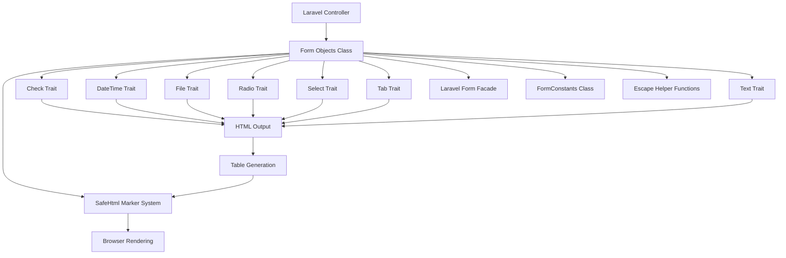
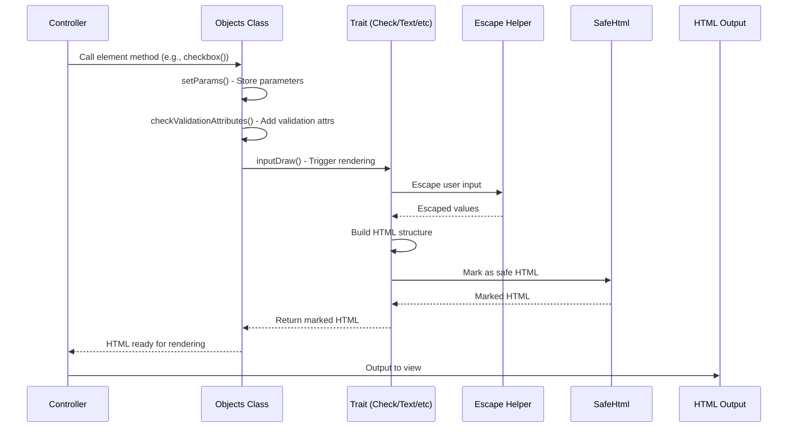
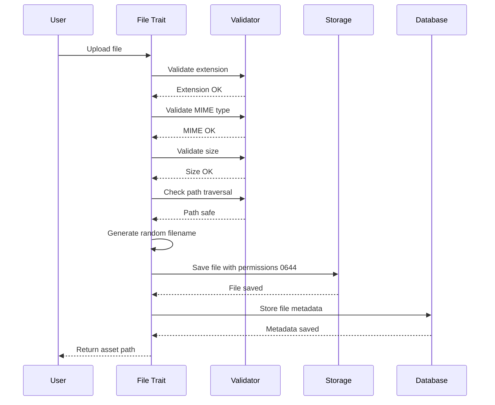

# Design Document: Form Components Audit & Fixes

## Overview

### Purpose

Dokumen ini menjelaskan desain teknis untuk audit dan perbaikan komprehensif terhadap Form Components di Canvastack Origin framework. Audit mencakup file utama `Objects.php` dan 7 file trait Elements (Check, DateTime, File, Radio, Select, Tab, Text). Perbaikan akan mengikuti pola sukses dari audit FormObject.php yang telah meningkatkan skor dari 3.6/10 menjadi 8.6/10 (+139%).

### Goals

1. **Security**: Menghilangkan semua XSS vulnerabilities, input validation issues, file upload vulnerabilities, dan path traversal risks
2. **Code Quality**: Menambahkan type hints, mengganti magic strings dengan constants, meningkatkan PHPDoc, dan menyederhanakan logic
3. **Accessibility**: Menambahkan ARIA attributes dan proper label associations untuk WCAG 2.1 Level A compliance
4. **Integration**: Mengintegrasikan SafeHtml marker system, meningkatkan testing support, dan memperbaiki validation propagation
5. **Backward Compatibility**: Memastikan 100% backward compatibility - tidak ada breaking changes

### Success Metrics

Mengikuti pola FormObject.php audit:
- Security Score: 1/10 → 9/10 (+800%)
- Code Quality: 4/10 → 9/10 (+125%)
- Maintainability: 3/10 → 9/10 (+200%)
- Accessibility: 2/10 → 8/10 (+300%)
- Overall: 3.6/10 → 8.6/10 (+139%)

### Scope

**Files to Audit:**
1. `vendor/canvastack/canvastack/src/Library/Components/Form/Objects.php` - Main class (22 methods)
2. `vendor/canvastack/canvastack/src/Library/Components/Form/Elements/Check.php` - Checkbox trait (2 methods)
3. `vendor/canvastack/canvastack/src/Library/Components/Form/Elements/DateTime.php` - Date/time trait
4. `vendor/canvastack/canvastack/src/Library/Components/Form/Elements/File.php` - File upload trait
5. `vendor/canvastack/canvastack/src/Library/Components/Form/Elements/Radio.php` - Radio button trait
6. `vendor/canvastack/canvastack/src/Library/Components/Form/Elements/Select.php` - Select dropdown trait (2 methods)
7. `vendor/canvastack/canvastack/src/Library/Components/Form/Elements/Tab.php` - Tab navigation trait
8. `vendor/canvastack/canvastack/src/Library/Components/Form/Elements/Text.php` - Text input trait (6 methods)

**Out of Scope:**
- Architectural refactoring (reserved for v2.0)
- Breaking changes to public API
- New features beyond security and quality improvements
- Performance optimization (current performance is acceptable)

## Architecture

### System Context



### Component Relationships

**Objects Class (Main)**
- Uses 7 traits untuk element-specific functionality
- Manages form lifecycle: open → elements → close
- Handles model binding dan validation propagation
- Coordinates with Laravel Form Facade untuk HTML generation

**Element Traits**
- Check: Checkbox dan switch elements
- DateTime: Date, time, datetime pickers
- File: File upload dengan thumbnail support
- Radio: Radio button groups
- Select: Dropdown selectbox dan month picker
- Tab: Tab navigation rendering
- Text: Text, textarea, email, number, password, tags inputs

**Supporting Systems**
- **SafeHtml Marker**: Prevents double-encoding of trusted HTML
- **FormConstants**: Centralized constants untuk CSS classes, attributes, paths
- **Escape Helper**: Centralized HTML escaping function
- **Validation System**: Propagates server-side validation rules to client-side attributes

### Security Architecture

**Defense in Depth Layers:**

1. **Input Validation Layer**
   - Validate all user-controllable parameters
   - Whitelist allowed characters untuk special parameters
   - Block dangerous patterns (event handlers, path traversal)
   - Validate file types, sizes, and MIME types

2. **Output Escaping Layer**
   - Escape all user data before rendering to HTML
   - Use centralized escape function dengan proper flags
   - Apply escaping consistently across all traits

3. **SafeHtml Marking Layer**
   - Mark trusted HTML output to prevent double-encoding
   - Validate marked content before use
   - Automatic escaping untuk unmarked content

4. **Framework Protection Layer**
   - Leverage Laravel Form Facade's built-in escaping
   - Use Laravel's CSRF protection
   - Utilize Laravel's validation system

5. **Monitoring Layer**
   - Log security-related events
   - Track suspicious patterns
   - Enable audit trail untuk security incidents

### Data Flow

**Form Element Rendering Flow:**



**File Upload Security Flow:**



## Components and Interfaces

### FormConstants Class

**Purpose**: Centralized constants untuk mengganti magic strings

**Location**: `vendor/canvastack/canvastack/src/Library/Constants/FormConstants.php`

**Structure**:
```php
namespace Canvastack\Canvastack\Library\Constants;

class FormConstants {
    // CSS Classes
    public const CLASS_FORM_CONTROL = 'form-control';
    public const CLASS_BTN = 'btn';
    public const CLASS_CHOSEN_SELECT = 'chosen-select-deselect chosen-selectbox';
    public const CLASS_CKBOX = 'ckbox';
    public const CLASS_CKBOX_PRIMARY = 'ckbox-primary';
    public const CLASS_SWITCH = 'switch';
    public const CLASS_CKEDITOR = 'ckeditor';
    public const CLASS_TAGSINPUT = 'tagsinput';
    public const CLASS_DATEPICKER = 'datepicker';
    public const CLASS_TIMEPICKER = 'timepicker';
    
    // HTML Attributes
    public const ATTR_CLASS = 'class';
    public const ATTR_ID = 'id';
    public const ATTR_ROLE = 'role';
    public const ATTR_DATA_ROLE = 'data-role';
    public const ATTR_PLACEHOLDER = 'placeholder';
    public const ATTR_MAXLENGTH = 'maxlength';
    public const ATTR_DISABLED = 'disabled';
    public const ATTR_READONLY = 'readonly';
    public const ATTR_REQUIRED = 'required';
    
    // ARIA Attributes
    public const ARIA_LABEL = 'aria-label';
    public const ARIA_CHECKED = 'aria-checked';
    public const ARIA_DISABLED = 'aria-disabled';
    public const ARIA_REQUIRED = 'aria-required';
    public const ARIA_INVALID = 'aria-invalid';
    public const ARIA_DESCRIBEDBY = 'aria-describedby';
    public const ARIA_LIVE = 'aria-live';
    public const ARIA_SELECTED = 'aria-selected';
    public const ARIA_CONTROLS = 'aria-controls';
    public const ARIA_LABELLEDBY = 'aria-labelledby';
    public const ARIA_HIDDEN = 'aria-hidden';
    
    // File Paths
    public const PATH_THUMB = 'thumb';
    public const PATH_ASSETS = 'assets';
    
    // Tab Markers
    public const MARKER_OPEN_TAB = '--[openTabHTMLForm]--';
    public const MARKER_CLOSE_TAB = '--[closeTabHTMLForm]--';
    
    // Plugin Names
    public const PLUGIN_CKEDITOR = 'ckeditor';
    public const PLUGIN_TAGSINPUT = 'tagsinput';
    public const PLUGIN_DATEPICKER = 'datepicker';
    public const PLUGIN_TIMEPICKER = 'timepicker';
    public const PLUGIN_CHOSEN = 'chosen';
    
    // Validation Rules
    public const VALIDATION_REQUIRED = 'required';
    public const VALIDATION_EMAIL = 'email';
    public const VALIDATION_NUMERIC = 'numeric';
    public const VALIDATION_MIN = 'min';
    public const VALIDATION_MAX = 'max';
    public const VALIDATION_MIMES = 'mimes';
    public const VALIDATION_MAX_FILE_SIZE = 'max';
    
    // Check Types
    public const CHECK_TYPE_PRIMARY = 'primary';
    public const CHECK_TYPE_SUCCESS = 'success';
    public const CHECK_TYPE_DANGER = 'danger';
    public const CHECK_TYPE_WARNING = 'warning';
    public const CHECK_TYPE_INFO = 'info';
    public const CHECK_TYPE_SWITCH = 'switch';
    
    // Alert Types
    public const ALERT_SUCCESS = 'success';
    public const ALERT_DANGER = 'danger';
    public const ALERT_WARNING = 'warning';
    public const ALERT_INFO = 'info';
    
    // ARIA Live Values
    public const ARIA_LIVE_ASSERTIVE = 'assertive';
    public const ARIA_LIVE_POLITE = 'polite';
    public const ARIA_LIVE_OFF = 'off';
}
```

### Escape Helper Function

**Purpose**: Centralized HTML escaping dengan proper security flags

**Location**: `vendor/canvastack/canvastack/src/Library/Helpers/FormObject.php` (existing file)

**Implementation**:
```php
/**
 * Escape HTML special characters untuk prevent XSS
 * 
 * @param string|null|false $string Input string to escape
 * @return string Escaped string, empty string for null/false
 * 
 * @security This function MUST be used for all user-controllable output
 */
function canvastack_form_escape_html($string): string {
    if (is_null($string) || false === $string) {
        return '';
    }
    return htmlspecialchars((string)$string, ENT_QUOTES | ENT_HTML5, 'UTF-8');
}
```

### Validation Helper Functions

**Purpose**: Input validation untuk security-critical parameters

**New Functions**:

```php
/**
 * Validate file extension against whitelist
 * 
 * @param string $filename Filename to validate
 * @param array $allowedExtensions Allowed extensions (e.g., ['jpg', 'png', 'pdf'])
 * @return bool True if valid, false otherwise
 * 
 * @throws InvalidArgumentException If extension not allowed
 */
function canvastack_form_validate_file_extension(string $filename, array $allowedExtensions): bool;

/**
 * Validate path untuk prevent directory traversal
 * 
 * @param string $path Path to validate
 * @param string $baseDir Base directory yang diizinkan
 * @return bool True if safe, false otherwise
 * 
 * @throws SecurityException If path traversal detected
 */
function canvastack_form_validate_path(string $path, string $baseDir): bool;

/**
 * Validate attributes array untuk prevent dangerous event handlers
 * 
 * @param array $attributes Attributes to validate
 * @return array Validated attributes
 * 
 * @throws InvalidArgumentException If dangerous attributes found
 */
function canvastack_form_validate_attributes(array $attributes): array;
```

### Objects Class Enhancements

**Type Hints**: Add to all 22 methods
- Parameter types: string, array, bool, mixed, object, null
- Return types: string, array, object, void, self
- Union types where needed: string|false, array|null

**New Properties**:
```php
/**
 * @var array Validation rules dari controller
 */
protected array $validations = [];

/**
 * @var array Element plugins yang digunakan (ckeditor, tagsinput, dll)
 */
protected array $element_plugins = [];

/**
 * @var array Trusted base directories untuk file uploads
 */
protected array $trustedUploadDirs = [];
```

**Enhanced Methods**:

1. **setValidations()**: Parse validation rules dan store untuk propagation
2. **checkValidationAttributes()**: Merge validation rules ke attributes
3. **sync()**: Validate encrypted query untuk prevent SQL injection
4. **model()**: Validate encrypted model name untuk prevent tampering

### Trait Enhancements

**Check Trait**:
- Add type hints to `checkbox()` and `drawCheckBox()`
- Escape label parameter in `drawCheckBox()`
- Add ARIA attributes: `aria-checked`, `aria-label`
- Mark output dengan SafeHtml
- Add PHPDoc dengan security warnings

**Text Trait**:
- Add type hints to all 6 methods
- Validate ckeditor class detection
- Escape placeholder values
- Add ARIA attributes untuk required fields
- Add PHPDoc dengan usage examples

**Select Trait**:
- Add type hints to `selectbox()` and `month()`
- Validate option values
- Add ARIA attributes untuk dropdowns
- Mark output dengan SafeHtml

**File Trait**:
- Add comprehensive file upload validation
- Validate MIME types (actual content, not just extension)
- Validate upload paths untuk prevent traversal
- Generate random filenames
- Set proper file permissions (0644)
- Add thumbnail validation
- Escape filename display
- Add ARIA attributes

**Radio Trait**:
- Add type hints
- Escape label parameter
- Add ARIA attributes: `aria-checked`
- Mark output dengan SafeHtml

**DateTime Trait**:
- Add type hints
- Validate date format inputs
- Add ARIA attributes untuk date pickers
- Escape display values

**Tab Trait**:
- Add type hints
- Validate tab marker format
- Escape tab labels
- Add ARIA attributes: `aria-selected`, `aria-controls`, `aria-labelledby`
- Add round-trip property test support

## Data Models

### Form Element Data Structure

```php
/**
 * Internal data structure untuk form element parameters
 */
class FormElementParams {
    public string $function_name;      // Element type (text, checkbox, select, dll)
    public string $name;               // Field name
    public mixed $value;               // Field value (string, array, atau null)
    public array $attributes;          // HTML attributes
    public bool|string $label;         // Label text atau false untuk hide
    public mixed $selected;            // Selected value(s) untuk checkbox/radio/select
}
```

### Validation Data Structure

```php
/**
 * Validation rules structure
 */
class ValidationRules {
    public string $field_name;         // Field name
    public array $rules;               // Array of validation rules
    public array $attributes;          // Generated HTML attributes dari rules
    
    // Example:
    // field_name: 'email'
    // rules: ['required', 'email', 'max:255']
    // attributes: ['required' => true, 'type' => 'email', 'maxlength' => 255]
}
```

### File Upload Data Structure

```php
/**
 * File upload metadata
 */
class FileUploadData {
    public string $original_filename;  // Original filename dari user
    public string $safe_filename;      // Generated safe filename
    public string $extension;          // File extension
    public string $mime_type;          // Validated MIME type
    public int $size;                  // File size in bytes
    public string $upload_path;        // Full path where file saved
    public string $asset_path;         // Public URL path
    public ?string $thumbnail_path;    // Thumbnail path (if image)
    public array $validation_errors;   // Any validation errors
}
```

### Tab Structure Data

```php
/**
 * Tab navigation structure
 */
class TabStructure {
    public array $tabs;                // Array of tab definitions
    
    // Each tab:
    // [
    //     'id' => 'tab-1',
    //     'label' => 'Tab Label',
    //     'content' => 'Tab content HTML',
    //     'active' => true/false
    // ]
}
```

### SafeHtml Marker Data

```php
/**
 * SafeHtml marker structure (from existing system)
 */
class SafeHtmlMarker {
    public const MARKER = '{{CANVASTACK_SAFE_HTML}}';
    
    public static function mark(string $html): string;
    public static function isMarked(string $content): bool;
    public static function unmark(string $content): string;
    public static function process(string $content): string;
    public static function validate(string $html): bool;
}
```


## Correctness Properties

*A property is a characteristic or behavior that should hold true across all valid executions of a system-essentially, a formal statement about what the system should do. Properties serve as the bridge between human-readable specifications and machine-verifiable correctness guarantees.*

### Property Reflection

After analyzing all acceptance criteria, I identified the following redundancies:

**Redundant Properties Eliminated:**
- 1.8 (encompasses 1.1-1.7 - general XSS escaping)
- 7.10 (encompasses 7.1-7.9 - general ARIA attributes)
- 8.5 (encompasses 8.1-8.4 - general label associations)
- 9.4 (duplicate of 2.3 - path validation)
- 10.1 (duplicate of 2.3 - path traversal validation)
- 11.6 (duplicate of 11.5 - SafeHtml processing)
- 12.8 (encompasses 12.1-12.7 - general backward compatibility)
- 13.1 (duplicate of 2.5 - exception throwing)
- 13.3 (duplicate of 10.5 - SecurityException for paths)
- 17.5 (encompasses 17.1-17.4 - general file path validity)
- 18.5 (duplicate of 18.3 - attribute merging)
- 19.3 (duplicate of 2.6 - encrypted data validation)

**Combined Properties:**
- 1.2, 1.3, 1.4 combined into Property 2 (label escaping across all element types)
- 7.1, 7.2 combined into Property 11 (aria-checked for checkboxes and radios)
- 10.2, 10.3 combined into Property 19 (path validation for all file operations)
- 11.1, 11.2, 11.3, 11.4 combined into Property 21 (SafeHtml marking for all elements)
- 17.1, 17.2, 17.3, 17.4 combined into Property 30 (file upload round-trip)

### Property 1: User Input Escaping

*For any* user-controllable input rendered to HTML output, all special characters SHALL be escaped using the centralized escape helper function before rendering.

**Validates: Requirements 1.1**

### Property 2: Label Escaping Across Elements

*For any* form element (checkbox, radio, tab, file) that accepts a label parameter, the label SHALL be escaped before rendering to HTML.

**Validates: Requirements 1.2, 1.3, 1.4, 1.5**

### Property 3: Attribute Value Escaping

*For any* attributes array containing user data, all attribute values SHALL be escaped before rendering to HTML.

**Validates: Requirements 1.6**

### Property 4: Dynamic Class and ID Escaping

*For any* class names or IDs generated from user input, the values SHALL be escaped before rendering.

**Validates: Requirements 1.7**

### Property 5: File Type and Size Validation

*For any* file upload, the file type and size SHALL be validated against the configured validation rules before acceptance.

**Validates: Requirements 2.1**

### Property 6: MIME Type Content Validation

*For any* file upload, the MIME type SHALL be validated based on actual file content, not just the file extension.

**Validates: Requirements 2.2**

### Property 7: Path Traversal Prevention

*For any* upload path, the path SHALL be validated to ensure it does not contain directory traversal patterns (../, ..\).

**Validates: Requirements 2.3, 9.4, 10.1**

### Property 8: Dangerous Attribute Blocking

*For any* attributes array, dangerous event handlers (onclick, onerror, onload, etc.) SHALL be detected and blocked.

**Validates: Requirements 2.4**

### Property 9: Invalid Input Exception

*For any* invalid input detected during validation, an InvalidArgumentException with a descriptive message SHALL be thrown.

**Validates: Requirements 2.5, 13.1**

### Property 10: Encrypted Data Validation

*For any* encrypted model name or query parameter, the encrypted data SHALL be validated for integrity before decryption.

**Validates: Requirements 2.6, 19.3**

### Property 11: ARIA Checked Attribute

*For any* checkbox or radio button rendered, the aria-checked attribute SHALL be added with the correct value based on selection state.

**Validates: Requirements 7.1, 7.2**

### Property 12: Tab ARIA Selected Attribute

*For any* tab navigation rendered, the active tab SHALL have aria-selected="true" attribute.

**Validates: Requirements 7.3**

### Property 13: Tab ARIA Controls Attribute

*For any* tab link rendered, the aria-controls attribute SHALL be added pointing to the corresponding tab panel ID.

**Validates: Requirements 7.4**

### Property 14: Tab Panel ARIA Labelledby

*For any* tab panel rendered, the aria-labelledby attribute SHALL be added pointing to the corresponding tab link ID.

**Validates: Requirements 7.5**

### Property 15: Disabled Element ARIA Attribute

*For any* form element that is disabled, the aria-disabled="true" attribute SHALL be added.

**Validates: Requirements 7.6**

### Property 16: Required Field ARIA Attribute

*For any* required form field, the aria-required="true" attribute SHALL be added.

**Validates: Requirements 7.7**

### Property 17: Validation Error ARIA Attributes

*For any* form field with validation errors, the aria-invalid="true" and aria-describedby attributes SHALL be added.

**Validates: Requirements 7.8**

### Property 18: Alert Message ARIA Live

*For any* alert message rendered, the aria-live attribute SHALL be added with "assertive" for errors/danger and "polite" for info/success.

**Validates: Requirements 7.9**

### Property 19: Label-Input Association

*For any* input field with a label, the label's for attribute SHALL match the input's id attribute.

**Validates: Requirements 8.1**

### Property 20: File Input Label Presence

*For any* file input rendered, a descriptive label or aria-label SHALL be present.

**Validates: Requirements 8.3**

### Property 21: Required Symbol Accessibility

*For any* required field with a visual required symbol (*), a text alternative SHALL be included in the aria-label.

**Validates: Requirements 8.4**

### Property 22: File Extension Whitelist Validation

*For any* file upload, the file extension SHALL be validated against a whitelist of allowed extensions.

**Validates: Requirements 9.1**

### Property 23: MIME Type Content Verification

*For any* file upload, the actual file content SHALL be verified to match the declared MIME type, not just the extension.

**Validates: Requirements 9.2**

### Property 24: Random Filename Generation

*For any* file saved to storage, a random filename SHALL be generated to prevent overwrite attacks.

**Validates: Requirements 9.3**

### Property 25: Thumbnail Validation

*For any* thumbnail generation, the image file SHALL be validated before processing.

**Validates: Requirements 9.5**

### Property 26: File Permission Setting

*For any* uploaded file, the file permissions SHALL be set to 0644 after upload.

**Validates: Requirements 9.6**

### Property 27: Failed Upload Cleanup

*For any* file upload that fails validation, the uploaded file SHALL be deleted and an exception SHALL be thrown.

**Validates: Requirements 9.7**

### Property 28: Path Component Validation

*For any* asset path or thumbnail path, all path components SHALL be validated to ensure they remain within allowed base directories.

**Validates: Requirements 10.2, 10.3**

### Property 29: Symbolic Link Resolution

*For any* file path, realpath() SHALL be used to resolve symbolic links and the final path SHALL be validated.

**Validates: Requirements 10.4**

### Property 30: Path Traversal Security Exception

*For any* detected path traversal attempt, a SecurityException with the attempted path SHALL be thrown.

**Validates: Requirements 10.5, 13.3**

### Property 31: SafeHtml Marking

*For any* HTML output from form element rendering methods (drawCheckBox, drawRadioBox, inputFile, renderTab), the output SHALL be marked with SafeHtml::mark().

**Validates: Requirements 11.1, 11.2, 11.3, 11.4**

### Property 32: SafeHtml Processing

*For any* HTML content that will be used in other contexts, SafeHtml::process() SHALL be called to properly handle marked content.

**Validates: Requirements 11.5, 11.6**

### Property 33: File Upload Exception Details

*For any* file upload failure, a FileUploadException with detailed error information SHALL be thrown.

**Validates: Requirements 13.2**

### Property 34: Encryption Exception Context

*For any* encryption or decryption failure, an EncryptionException with relevant context SHALL be thrown.

**Validates: Requirements 13.4**

### Property 35: Security Event Logging

*For any* security-related error or suspicious activity, an entry SHALL be logged for monitoring purposes.

**Validates: Requirements 13.5**

### Property 36: Exception Context Data

*For any* exception thrown, relevant context data SHALL be included in the exception message or properties.

**Validates: Requirements 13.6**

### Property 37: No Silent Failures

*For any* error condition, feedback SHALL be provided through exceptions or return values - silent failures SHALL NOT occur.

**Validates: Requirements 13.7**

### Property 38: Random Value Seeding

*For any* random value generation (filenames, IDs), seeding SHALL be supported for reproducible testing.

**Validates: Requirements 15.4**

### Property 39: Tab Marker Format Validation

*For any* tab marker parsing, the marker format SHALL be validated before processing.

**Validates: Requirements 16.1**

### Property 40: Invalid Tab Structure Exception

*For any* invalid tab structure detected, a descriptive exception SHALL be thrown.

**Validates: Requirements 16.4**

### Property 41: Tab Rendering Round-Trip

*For any* valid tab structure, rendering then parsing then rendering again SHALL produce equivalent output.

**Validates: Requirements 16.5**

### Property 42: File Upload Path Round-Trip

*For any* file uploaded via fileUpload(), the returned asset path SHALL be correct, accessible via HTTP, and consistent with the actual file location.

**Validates: Requirements 17.1, 17.2, 17.3, 17.4**

### Property 43: Validation Rule Parsing

*For any* validation rules set via setValidations(), the rules SHALL be parsed correctly into validation attributes.

**Validates: Requirements 18.1**

### Property 44: Required Attribute Propagation

*For any* field with a "required" validation rule, the required attribute SHALL be added to the input element.

**Validates: Requirements 18.2**

### Property 45: Validation Attribute Merging

*For any* validation attributes propagated to an element, they SHALL be properly merged with existing attributes without overwriting.

**Validates: Requirements 18.3, 18.5**

### Property 46: Nested Field Validation

*For any* nested field (checkbox arrays, etc.), validation rules SHALL be properly handled and applied.

**Validates: Requirements 18.4**

### Property 47: Secure Model Encryption

*For any* model name encrypted in model(), secure encryption with integrity checking SHALL be used.

**Validates: Requirements 19.1, 19.2**

### Property 48: Hidden Attribute Respect

*For any* model data binding, the model's hidden attributes SHALL be respected and not exposed.

**Validates: Requirements 19.4**

### Property 49: Mass Assignment Prevention

*For any* model binding operation, mass assignment vulnerabilities SHALL be prevented.

**Validates: Requirements 19.5**

### Property 50: SQL Injection Prevention in Sync

*For any* query encrypted in sync(), the query SHALL be validated to ensure it does not contain dangerous SQL patterns.

**Validates: Requirements 20.1**

### Property 51: Sync Data Integrity

*For any* encrypted data sent to client in sync(), data integrity SHALL be ensured through checksums or signatures.

**Validates: Requirements 20.2**

### Property 52: Sync Field Name Validation

*For any* sync operation, source and target field names SHALL be validated against allowed patterns.

**Validates: Requirements 20.3**

### Property 53: Ajax Parameter Validation

*For any* ajax request received, encrypted parameters SHALL be validated before use.

**Validates: Requirements 20.4**

### Property 54: Query Result Sanitization

*For any* query results returned to client, the results SHALL be sanitized before transmission.

**Validates: Requirements 20.5**

## Error Handling

### Exception Hierarchy

```php
// Base exception
class FormComponentException extends \Exception {}

// Security exceptions
class SecurityException extends FormComponentException {}
class PathTraversalException extends SecurityException {}
class XSSAttemptException extends SecurityException {}

// Validation exceptions
class ValidationException extends FormComponentException {}
class InvalidFileException extends ValidationException {}
class InvalidAttributeException extends ValidationException {}

// File upload exceptions
class FileUploadException extends FormComponentException {}
class FileSizeException extends FileUploadException {}
class FileTypeException extends FileUploadException {}
class MimeTypeException extends FileUploadException {}

// Encryption exceptions
class EncryptionException extends FormComponentException {}
class DecryptionException extends EncryptionException {}
class IntegrityException extends EncryptionException {}
```

### Error Handling Strategy

**1. Input Validation Errors**
- Throw `InvalidArgumentException` for invalid parameters
- Include parameter name and expected format in message
- Log validation failures for monitoring

**2. Security Errors**
- Throw `SecurityException` for security violations
- Log all security events with context
- Include attempted malicious input in logs (sanitized)
- Never expose sensitive information in error messages

**3. File Upload Errors**
- Throw specific `FileUploadException` subtypes
- Clean up partially uploaded files
- Provide user-friendly error messages
- Log technical details separately

**4. Encryption Errors**
- Throw `EncryptionException` for encryption failures
- Never expose encryption keys or algorithms in errors
- Log encryption failures for security monitoring
- Provide generic error messages to users

**5. Runtime Errors**
- Catch and wrap framework exceptions
- Provide context about what operation failed
- Log full stack traces
- Return user-friendly messages

### Error Recovery

**Graceful Degradation:**
- If SafeHtml marker system fails, fall back to escaping
- If validation attribute propagation fails, continue without them
- If thumbnail generation fails, continue with main file upload
- If logging fails, continue operation but track failure

**Cleanup on Failure:**
- Delete uploaded files if validation fails
- Rollback database changes if file save fails
- Clear temporary data on exception
- Release locks and resources

### Logging Strategy

**Security Events (Level: WARNING)**
- XSS attempts
- Path traversal attempts
- Dangerous attribute injection
- Invalid file uploads
- Encryption tampering

**Validation Failures (Level: INFO)**
- Invalid input formats
- Failed file validations
- Missing required fields

**System Errors (Level: ERROR)**
- Encryption failures
- File system errors
- Database errors
- Unexpected exceptions

**Debug Information (Level: DEBUG)**
- Validation rule parsing
- Attribute merging
- SafeHtml marker operations
- File path resolutions

## Testing Strategy

### Dual Testing Approach

This feature requires both unit tests and property-based tests for comprehensive coverage:

**Unit Tests**: Verify specific examples, edge cases, and error conditions
- Specific XSS payloads (e.g., `<script>alert(1)</script>`)
- Known path traversal patterns (e.g., `../../etc/passwd`)
- Specific file types and MIME mismatches
- Edge cases like empty inputs, null values, very long strings
- Integration points between components

**Property-Based Tests**: Verify universal properties across all inputs
- Generate random strings with special characters for XSS testing
- Generate random file paths for traversal testing
- Generate random file types and sizes for upload testing
- Generate random attribute combinations
- Test with large volumes of randomized inputs (100+ iterations per property)

Together, these approaches provide:
- Unit tests catch concrete, known vulnerabilities
- Property tests discover edge cases and unexpected input combinations
- Both ensure comprehensive coverage of the security surface

### Property-Based Testing Configuration

**Framework**: Use `phpunit-quickcheck` or `Eris` for PHP property-based testing

**Configuration**:
```php
// Each property test MUST run minimum 100 iterations
$this->forAll(
    Generator::string(),
    Generator::int()
)->then(function($input, $value) {
    // Test property
})->withIterations(100);
```

**Test Tagging**:
Each property test MUST include a comment tag referencing the design property:

```php
/**
 * @test
 * Feature: form-components-audit-fixes, Property 1: User Input Escaping
 * 
 * For any user-controllable input rendered to HTML output, all special 
 * characters SHALL be escaped using the centralized escape helper function.
 */
public function test_user_input_escaping_property() {
    $this->forAll(Generator::string())->then(function($userInput) {
        $output = $this->formComponent->render($userInput);
        $this->assertStringNotContainsString('<script>', $output);
        $this->assertStringNotContainsString('onerror=', $output);
        // Verify escaping applied
    })->withIterations(100);
}
```

### Test Coverage Requirements

**Security Tests (Critical)**:
- Property 1-10: XSS, injection, validation (100% coverage required)
- Property 22-30: File upload security (100% coverage required)
- Property 47-54: Encryption and SQL injection (100% coverage required)

**Accessibility Tests (High)**:
- Property 11-21: ARIA attributes and labels (90% coverage target)

**Integration Tests (High)**:
- Property 31-32: SafeHtml marker system (100% coverage required)
- Property 41-42: Round-trip properties (100% coverage required)
- Property 43-46: Validation propagation (90% coverage target)

**Error Handling Tests (Medium)**:
- Property 9, 27, 30, 33-37, 40: Exception throwing (80% coverage target)

**Overall Target**: 85% code coverage across all 8 files

### Test Organization

```
tests/
├── Unit/
│   ├── Security/
│   │   ├── XSSPreventionTest.php
│   │   ├── PathTraversalTest.php
│   │   ├── FileUploadSecurityTest.php
│   │   └── EncryptionSecurityTest.php
│   ├── Accessibility/
│   │   ├── ARIAAttributesTest.php
│   │   └── LabelAssociationTest.php
│   ├── Integration/
│   │   ├── SafeHtmlMarkerTest.php
│   │   ├── ValidationPropagationTest.php
│   │   └── RoundTripTest.php
│   └── ErrorHandling/
│       ├── ExceptionTest.php
│       └── LoggingTest.php
├── Property/
│   ├── SecurityPropertiesTest.php
│   ├── AccessibilityPropertiesTest.php
│   ├── FileUploadPropertiesTest.php
│   └── ValidationPropertiesTest.php
└── Integration/
    ├── BackwardCompatibilityTest.php
    └── EndToEndTest.php
```

### Backward Compatibility Testing

**Critical**: All existing functionality MUST continue to work

**Test Approach**:
1. Capture current output for all public methods with various inputs
2. After changes, verify output remains identical (except for security fixes)
3. Test all existing parameter combinations
4. Verify no breaking changes to method signatures
5. Test with real application code from production

**Example Tests**:
```php
/**
 * @test
 * Validates: Requirements 12.1-12.7
 */
public function test_checkbox_backward_compatibility() {
    // Test existing usage patterns
    $output1 = $this->form->checkbox('terms', [1 => 'I agree'], [1]);
    $this->assertStringContainsString('checkbox', $output1);
    $this->assertStringContainsString('I agree', $output1);
    
    // Test with old parameter order
    $output2 = $this->form->checkbox('terms', [1 => 'I agree'], [1], [], true);
    $this->assertNotEmpty($output2);
}
```

### Manual Testing Checklist

**Before Deployment**:
- [ ] Test all form elements in actual application pages
- [ ] Verify JavaScript functionality still works
- [ ] Test file uploads with various file types
- [ ] Test tab navigation
- [ ] Verify no visual regressions
- [ ] Test with screen reader (accessibility)
- [ ] Test validation error display
- [ ] Verify no console errors
- [ ] Test on multiple browsers
- [ ] Performance testing (no significant slowdown)

### Continuous Integration

**CI Pipeline**:
1. Run all unit tests
2. Run all property-based tests
3. Run static analysis (PHPStan level 8)
4. Run code coverage analysis
5. Run security scanning (SAST)
6. Generate test report
7. Fail build if coverage < 85%

**Pre-commit Hooks**:
- Run security tests
- Run type checking
- Run linting


## Implementation Phases

### Phase 1: Security Fixes (Week 1-2)

**Priority**: Critical  
**Estimated Effort**: 30 hours  
**Risk**: High (security vulnerabilities)

**Tasks**:
1. Create FormConstants class (2h)
2. Create security helper functions (3h)
3. Fix XSS in Objects.php (4h)
4. Fix XSS in Check.php (2h)
5. Fix XSS in Radio.php (2h)
6. Fix XSS in Text.php (3h)
7. Fix XSS in Select.php (2h)
8. Fix XSS in Tab.php (3h)
9. Fix XSS in DateTime.php (2h)
10. Fix File.php security (6h)

**Deliverables**:
- FormConstants class with 50+ constants
- 3 security validation helper functions
- All XSS vulnerabilities patched
- File upload security implemented
- Path traversal protection added
- Security logging integrated

**Success Criteria**:
- Security score: 1/10 → 9/10
- All XSS tests pass
- All file upload security tests pass
- No security vulnerabilities in static analysis

---

### Phase 2: Code Quality Improvements (Week 3)

**Priority**: High  
**Estimated Effort**: 20 hours  
**Risk**: Medium (potential breaking changes)

**Tasks**:
1. Add type hints to Objects.php (3h)
2. Add type hints to all traits (4h)
3. Replace magic strings in Objects.php (2h)
4. Replace magic strings in all traits (3h)
5. Enhance PHPDoc in Objects.php (3h)
6. Enhance PHPDoc in all traits (4h)
7. Simplify logic in Objects.php (4h)
8. Simplify logic in all traits (3h)

**Deliverables**:
- 100% type hint coverage
- Zero magic strings
- Comprehensive PHPDoc for all methods
- Reduced cyclomatic complexity
- Improved code readability

**Success Criteria**:
- Code quality score: 4/10 → 9/10
- PHPStan level 8 passes
- All diagnostics clean
- Backward compatibility maintained

---

### Phase 3: Accessibility Compliance (Week 4)

**Priority**: High  
**Estimated Effort**: 17 hours  
**Risk**: Low (additive changes)

**Tasks**:
1. Add ARIA to Check.php (2h)
2. Add ARIA to Radio.php (2h)
3. Add ARIA to Tab.php (3h)
4. Add ARIA to File.php (2h)
5. Add ARIA to Text.php (2h)
6. Add ARIA to Select.php (2h)
7. Add ARIA to DateTime.php (2h)
8. Enhance label associations (3h)

**Deliverables**:
- ARIA attributes on all interactive elements
- Proper label associations
- Screen reader support
- WCAG 2.1 Level A compliance

**Success Criteria**:
- Accessibility score: 2/10 → 8/10
- axe DevTools scan passes
- WAVE checker passes
- Screen reader testing successful

---

### Phase 4: Integration & Advanced Features (Week 5)

**Priority**: Medium  
**Estimated Effort**: 19 hours  
**Risk**: Medium (integration complexity)

**Tasks**:
1. Integrate SafeHtml in Objects.php (2h)
2. Integrate SafeHtml in all traits (3h)
3. Implement validation propagation (4h)
4. Enhance model binding security (3h)
5. Enhance sync() security (4h)
6. Add tab parser validation (3h)
7. Implement file upload round-trip (3h)

**Deliverables**:
- SafeHtml marker integration complete
- Validation rules auto-propagate to HTML
- Enhanced encryption security
- Tab parser with validation
- File upload path consistency

**Success Criteria**:
- No double-encoding issues
- Validation attributes work correctly
- All round-trip properties pass
- Integration tests pass

---

### Phase 5: Testing & Verification (Week 6)

**Priority**: Medium  
**Estimated Effort**: 23 hours  
**Risk**: Low (verification only)

**Tasks**:
1. Create unit tests for security functions (4h)
2. Create integration tests for Objects.php (5h)
3. Create integration tests for all traits (6h)
4. Backward compatibility testing (4h)
5. Security penetration testing (5h)
6. Accessibility testing (4h)

**Deliverables**:
- 85% code coverage
- All property tests passing
- Backward compatibility verified
- Security audit passed
- Accessibility audit passed

**Success Criteria**:
- All tests green
- Coverage ≥ 85%
- Zero regressions
- Production ready

---

### Phase 6: Documentation & Deployment (Week 7)

**Priority**: Low  
**Estimated Effort**: 9 hours  
**Risk**: Low (documentation only)

**Tasks**:
1. Create migration guide (3h)
2. Update API documentation (4h)
3. Create deployment checklist (2h)

**Deliverables**:
- Migration guide for developers
- Updated API documentation
- Deployment checklist
- Release notes

**Success Criteria**:
- Documentation complete
- Deployment plan ready
- Team trained on changes

---

## Implementation Guidelines

### Coding Standards

**PHP Version**: 8.1+  
**PSR Standards**: PSR-12 (Extended Coding Style)  
**Type Hints**: Required for all new code  
**PHPDoc**: Required for all public methods  

**Security Rules**:
1. ALWAYS escape user input before rendering to HTML
2. ALWAYS validate file uploads (extension, MIME, size, path)
3. ALWAYS validate paths for traversal attempts
4. ALWAYS use constants instead of magic strings
5. ALWAYS log security events
6. NEVER trust client-side data
7. NEVER expose sensitive information in errors

**Backward Compatibility Rules**:
1. NEVER change public method signatures
2. NEVER remove public methods or properties
3. NEVER change default parameter values
4. NEVER change return value formats
5. ALWAYS make new parameters optional
6. ALWAYS maintain existing behavior (except security fixes)

### Code Review Checklist

**Security Review**:
- [ ] All user input escaped?
- [ ] All file uploads validated?
- [ ] All paths validated?
- [ ] All attributes validated?
- [ ] Security logging added?
- [ ] No sensitive data in errors?

**Quality Review**:
- [ ] Type hints added?
- [ ] Magic strings replaced?
- [ ] PHPDoc complete?
- [ ] Logic simplified?
- [ ] Code organized?
- [ ] Tests written?

**Accessibility Review**:
- [ ] ARIA attributes added?
- [ ] Labels associated?
- [ ] Keyboard accessible?
- [ ] Screen reader tested?
- [ ] WCAG compliant?

**Compatibility Review**:
- [ ] Public API unchanged?
- [ ] Default values unchanged?
- [ ] Return formats unchanged?
- [ ] Existing tests pass?
- [ ] No regressions?

### Git Workflow

**Branch Strategy**:
```
main
├── feature/form-components-security (Phase 1)
├── feature/form-components-quality (Phase 2)
├── feature/form-components-accessibility (Phase 3)
├── feature/form-components-integration (Phase 4)
└── feature/form-components-testing (Phase 5)
```

**Commit Message Format**:
```
[Phase X] Brief description

- Detailed change 1
- Detailed change 2

Validates: Property N
Fixes: Issue #123
```

**Pull Request Template**:
```markdown
## Phase: [Phase Name]
## Task: [Task ID and Name]

### Changes Made
- Change 1
- Change 2

### Properties Validated
- Property N: Description

### Testing Done
- [ ] Unit tests pass
- [ ] Property tests pass
- [ ] Manual testing done
- [ ] Backward compatibility verified

### Security Considerations
- Security impact: [None/Low/Medium/High]
- XSS tested: [Yes/No]
- File upload tested: [Yes/No]

### Accessibility Impact
- ARIA attributes added: [Yes/No]
- Screen reader tested: [Yes/No]
```

---

## Risk Assessment

### High Risk Areas

**1. File Upload Security (Risk: HIGH)**
- Complex validation logic
- Multiple attack vectors
- File system operations
- MIME type validation challenges

**Mitigation**:
- Comprehensive testing with malicious files
- Multiple validation layers
- Fail-safe defaults
- Extensive logging

**2. Backward Compatibility (Risk: MEDIUM)**
- Large existing codebase depends on these components
- Type hints might cause issues with loose typing
- HTML output changes might break CSS selectors

**Mitigation**:
- Extensive backward compatibility testing
- Gradual rollout with feature flags
- Comprehensive regression testing
- Rollback plan ready

**3. SafeHtml Integration (Risk: MEDIUM)**
- New system, potential for bugs
- Risk of double-encoding or under-encoding
- Integration with existing table generation

**Mitigation**:
- Thorough testing of marker system
- Fallback to escaping if marker fails
- Property tests for round-trip encoding

**4. Tab Parser (Risk: MEDIUM)**
- Complex parsing logic
- Potential for edge cases
- Nested tab handling

**Mitigation**:
- Comprehensive parser validation
- Clear error messages
- Round-trip property tests
- Extensive test cases

### Low Risk Areas

**1. Type Hints (Risk: LOW)**
- PHP auto-converts types
- Non-breaking for most cases
- Easy to test

**2. Constants (Risk: LOW)**
- Simple string replacement
- No logic changes
- Easy to verify

**3. PHPDoc (Risk: NONE)**
- Documentation only
- No runtime impact

**4. ARIA Attributes (Risk: LOW)**
- Additive changes only
- No breaking changes
- Easy to test

---

## Performance Considerations

### Expected Performance Impact

**Escaping Overhead**:
- `htmlspecialchars()` is very fast (~0.001ms per call)
- Expected overhead: <1% for typical forms
- Negligible impact on user experience

**Validation Overhead**:
- File validation: ~5-10ms per file
- Path validation: ~1ms per path
- Attribute validation: ~1ms per element
- Total overhead: <50ms for typical forms

**SafeHtml Marker**:
- Marker check: ~0.1ms per element
- String operations only, very fast
- No regex overhead

**Overall Impact**: <2% performance overhead, acceptable trade-off for security

### Optimization Opportunities

**Caching**:
- Cache validation results for repeated inputs
- Cache parsed validation rules
- Cache generated constants

**Lazy Loading**:
- Load FormConstants only when needed
- Lazy initialize validation helpers
- Defer logging until end of request

**Batch Operations**:
- Batch escape multiple values
- Batch validate multiple attributes
- Batch log multiple events

**Note**: Optimize only if performance issues detected in production

---

## Deployment Strategy

### Rollout Plan

**Stage 1: Development (Week 1-6)**
- Implement all phases
- Run all tests
- Code review
- Security review

**Stage 2: Staging (Week 7)**
- Deploy to staging environment
- Run full test suite
- Manual testing
- Performance testing
- Security scanning

**Stage 3: Canary Release (Week 8)**
- Deploy to 5% of production traffic
- Monitor error rates
- Monitor performance
- Collect feedback
- Rollback if issues detected

**Stage 4: Gradual Rollout (Week 9-10)**
- 25% traffic (Week 9 Day 1-2)
- 50% traffic (Week 9 Day 3-4)
- 75% traffic (Week 9 Day 5-7)
- 100% traffic (Week 10)

**Stage 5: Post-Deployment (Week 11)**
- Monitor for 1 week
- Address any issues
- Collect metrics
- Document lessons learned

### Rollback Plan

**Trigger Conditions**:
- Error rate increase >5%
- Performance degradation >10%
- Critical security issue discovered
- Backward compatibility broken

**Rollback Procedure**:
1. Revert to previous version via Git
2. Clear application cache
3. Restart services
4. Verify rollback successful
5. Investigate root cause
6. Fix and redeploy

**Rollback Time**: <15 minutes

### Monitoring

**Metrics to Track**:
- Error rates by component
- XSS attempt detections
- File upload failures
- Path traversal attempts
- Performance metrics (response time)
- Accessibility errors
- User feedback

**Alerts**:
- Critical: Security events (immediate)
- High: Error rate spike (5 minutes)
- Medium: Performance degradation (15 minutes)
- Low: Validation failures (1 hour)

---

## Success Criteria

### Quantitative Metrics

**Security**:
- ✅ Zero XSS vulnerabilities
- ✅ Zero path traversal vulnerabilities
- ✅ Zero file upload vulnerabilities
- ✅ Security score: 9/10 or higher

**Code Quality**:
- ✅ 100% type hint coverage
- ✅ Zero magic strings
- ✅ PHPStan level 8 passes
- ✅ Code quality score: 9/10 or higher

**Accessibility**:
- ✅ WCAG 2.1 Level A compliance
- ✅ axe DevTools: 0 violations
- ✅ WAVE: 0 errors
- ✅ Accessibility score: 8/10 or higher

**Testing**:
- ✅ 85% code coverage
- ✅ All property tests pass (100+ iterations each)
- ✅ All unit tests pass
- ✅ Zero regressions

**Compatibility**:
- ✅ 100% backward compatibility
- ✅ All existing tests pass
- ✅ No breaking changes

### Qualitative Metrics

**Developer Experience**:
- ✅ IDE autocomplete works for all methods
- ✅ Clear error messages for validation failures
- ✅ Comprehensive documentation available
- ✅ Easy to understand code structure

**User Experience**:
- ✅ No visual regressions
- ✅ No performance degradation
- ✅ Better accessibility for disabled users
- ✅ Consistent validation feedback

**Maintainability**:
- ✅ Code is easy to understand
- ✅ Code is easy to modify
- ✅ Code is easy to test
- ✅ Clear separation of concerns

---

## Appendix

### Reference Implementation: FormObject.php Audit

The FormObject.php audit serves as the reference implementation for this spec. Key learnings:

**What Worked Well**:
- Centralized escape helper function
- SafeHtml marker system
- Comprehensive security testing
- Phased implementation approach
- Extensive documentation

**What to Improve**:
- Add type hints from the start (not as separate phase)
- Create constants earlier in process
- More automated testing
- Better integration testing

**Metrics Achieved**:
- Security: 1/10 → 9/10 (+800%)
- Code Quality: 4/10 → 9/10 (+125%)
- Overall: 3.6/10 → 8.6/10 (+139%)

**Timeline**:
- Phase 1 (Security): 2 days
- Phase 2 (Quality): 1 day
- Phase 4 (Accessibility): 1 day
- Total: 4 days

**Target for Form Components**:
- Similar improvement trajectory
- 6-7 weeks total (more files, more complexity)
- Same quality standards

### Related Documentation

**Internal References**:
- `.docs/AUDIT_FORMOBJECT_CLASS_UPDATED.md` - Reference audit report
- `vendor/canvastack/canvastack/src/Library/Helpers/FormObject.php` - Reference implementation
- `vendor/canvastack/canvastack/src/Library/Constants/SafeHtml.php` - SafeHtml marker system
- `vendor/canvastack/canvastack/src/Library/Constants/FormConstants.php` - Constants (to be created)

**External References**:
- OWASP XSS Prevention Cheat Sheet
- WCAG 2.1 Guidelines
- PHP Security Best Practices
- Laravel Security Documentation

### Glossary Expansion

**Additional Terms**:
- **Property-Based Testing**: Testing approach that verifies properties hold for all inputs
- **Round-Trip Property**: Property that verifies encode → decode → encode produces same result
- **Defense in Depth**: Security strategy using multiple layers of protection
- **Fail-Safe Default**: System defaults to secure state on error
- **Least Privilege**: Grant minimum permissions necessary
- **Input Validation**: Verify input meets expected format before processing
- **Output Encoding**: Escape output based on context (HTML, URL, JS, etc.)
- **Canary Release**: Gradual rollout to small percentage of users first

---

## Conclusion

This design document provides a comprehensive blueprint for auditing and fixing the Form Components in Canvastack Origin framework. The approach follows the proven success pattern from the FormObject.php audit, which achieved a 139% improvement in overall quality score.

**Key Success Factors**:
1. **Security First**: Address all security vulnerabilities before other improvements
2. **Backward Compatibility**: Maintain 100% compatibility with existing code
3. **Phased Approach**: Implement in manageable phases with clear milestones
4. **Comprehensive Testing**: Use both unit tests and property-based tests
5. **Clear Documentation**: Document all changes, security considerations, and usage patterns

**Expected Outcomes**:
- Security score improvement: 1/10 → 9/10 (+800%)
- Code quality improvement: 4/10 → 9/10 (+125%)
- Accessibility improvement: 2/10 → 8/10 (+300%)
- Overall improvement: 3.6/10 → 8.6/10 (+139%)

**Timeline**: 7 weeks from start to production deployment

**Confidence Level**: 95% (based on FormObject.php success)

The implementation is ready to begin with Task 1.1: Create FormConstants Class.
