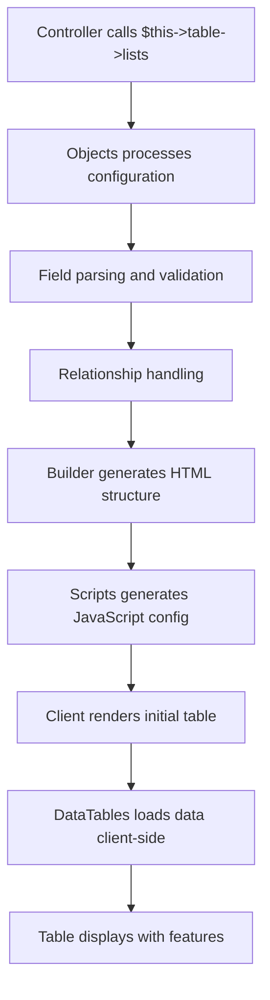
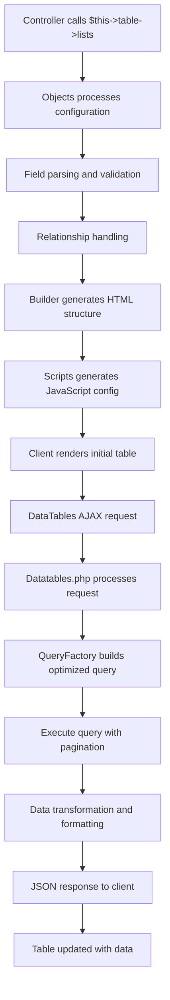
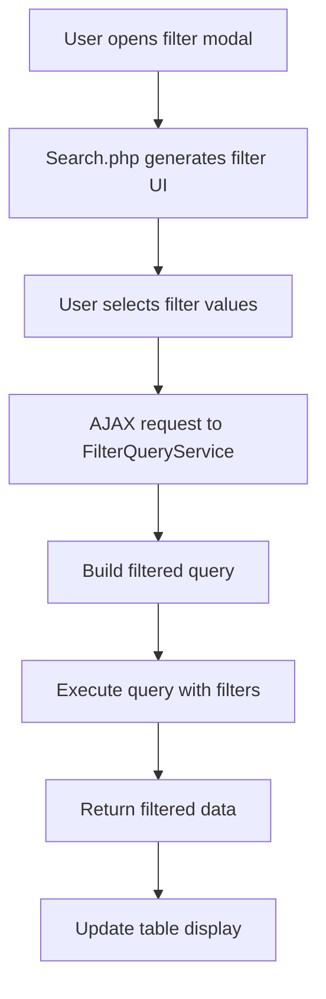

# Architecture Overview

CanvaStack Table is built on a modular, extensible architecture that provides powerful DataTables functionality while maintaining security, performance, and developer experience.

## Table of Contents

- [System Architecture](#system-architecture)
- [Component Layers](#component-layers)
- [Data Flow](#data-flow)
- [Design Patterns](#design-patterns)
- [Extension Points](#extension-points)
- [Performance Architecture](#performance-architecture)
- [Security Architecture](#security-architecture)

## System Architecture

```
┌─────────────────────────────────────────────────────────────────┐
│                        Presentation Layer                       │
│  ┌─────────────────┐  ┌─────────────────┐  ┌─────────────────┐ │
│  │   Controllers   │  │      Views      │  │   JavaScript    │ │
│  └─────────────────┘  └─────────────────┘  └─────────────────┘ │
└─────────────────────────────────────────────────────────────────┘
                                │
┌─────────────────────────────────────────────────────────────────┐
│                      CanvaStack Table Layer                     │
│  ┌─────────────────┐  ┌─────────────────┐  ┌─────────────────┐ │
│  │    Objects      │  │     Builder     │  │   Datatables    │ │
│  │ (Orchestrator)  │  │  (HTML/Config)  │  │ (Server-side)   │ │
│  └─────────────────┘  └─────────────────┘  └─────────────────┘ │
└─────────────────────────────────────────────────────────────────┘
                                │
┌─────────────────────────────────────────────────────────────────┐
│                        Processing Layer                         │
│  ┌─────────────────┐  ┌─────────────────┐  ┌─────────────────┐ │
│  │ QueryFactory    │  │     Search      │  │   Security      │ │
│  │ (Query Builder) │  │   (Filtering)   │  │ (Validation)    │ │
│  └─────────────────┘  └─────────────────┘  └─────────────────┘ │
└─────────────────────────────────────────────────────────────────┘
                                │
┌─────────────────────────────────────────────────────────────────┐
│                         Data Layer                              │
│  ┌─────────────────┐  ┌─────────────────┐  ┌─────────────────┐ │
│  │   Eloquent      │  │ Query Builder   │  │    Raw SQL      │ │
│  │    Models       │  │                 │  │                 │ │
│  └─────────────────┘  └─────────────────┘  └─────────────────┘ │
└─────────────────────────────────────────────────────────────────┘
                                │
┌─────────────────────────────────────────────────────────────────┐
│                        Database Layer                           │
│                    MySQL / PostgreSQL / SQLite                 │
└─────────────────────────────────────────────────────────────────┘
```

## Component Layers

### 1. Entry Point Layer

#### Objects Class
**Role**: Main orchestrator and entry point
**Responsibilities**:
- Configuration management
- Method chaining API
- Trait integration
- Rendering coordination

```php
class Objects extends Builder
{
    use Tab, ColumnsConfigTrait, AlignAndStyleTrait, ActionsTrait,
        ChartRenderTrait, LifecycleStateTrait, ModelQueryTrait,
        ListBuilderTrait, RelationsTrait, FilterSearchTrait,
        FormattingTrait, ColumnSetTrait;
    
    public function lists($table, $fields, $actions = false, ...): string
    {
        // Orchestrate the entire table building process
    }
}
```

### 2. Core Processing Layer

#### Builder Class
**Role**: HTML structure and configuration builder
**Responsibilities**:
- HTML table generation
- Column configuration
- Header/body construction
- Asset management

```php
class Builder
{
    public function table(): string
    {
        // Generate HTML table structure
    }
    
    public function header($data): string
    {
        // Build table header with columns
    }
    
    public function body(): string
    {
        // Generate table body structure
    }
}
```

#### Datatables Class
**Role**: Server-side processing engine
**Responsibilities**:
- AJAX request handling
- Data processing and transformation
- Pagination and sorting
- Security validation

```php
class Datatables
{
    public function process(): array
    {
        // Process DataTables AJAX requests
        // Apply filtering, sorting, pagination
        // Return formatted JSON response
    }
}
```

### 3. Query Management Layer

#### QueryFactory Class
**Role**: Query building and optimization
**Responsibilities**:
- SQL query construction
- Join optimization
- Where clause building
- Performance optimization

```php
class QueryFactory
{
    public function buildQuery($model, $conditions): Builder
    {
        // Build optimized database queries
        // Handle joins, filters, sorting
    }
}
```

#### ModelQueryBridge Class
**Role**: Data source abstraction
**Responsibilities**:
- Model resolution
- Query builder integration
- Raw SQL handling
- Dynamic table creation

### 4. Feature Layers

#### Search Class
**Role**: Advanced filtering system
**Responsibilities**:
- Filter modal generation
- Dependency chain management
- AJAX filter handling
- Security validation

#### Security Layer
**Role**: Security enforcement
**Responsibilities**:
- Input validation
- SQL injection prevention
- XSS protection
- Access control

## Data Flow

### GET Method Flow (Client-Side Processing)



### POST Method Flow (Server-Side Processing)



### Filter Flow



## Design Patterns

### 1. Fluent Interface Pattern

Enables method chaining for better developer experience:

```php
$this->table->method('POST')
            ->searchable()
            ->sortable()
            ->clickable()
            ->relations($model, 'group', 'name')
            ->filterGroups('status', 'selectbox', true)
            ->lists('users', ['name', 'email']);
```

### 2. Trait-Based Composition

Modular functionality through traits:

```php
class Objects extends Builder
{
    use ModelQueryTrait;      // Model and query handling
    use ActionsTrait;         // Action button management
    use RelationsTrait;       // Relationship handling
    use FilterSearchTrait;    // Filtering functionality
    use FormattingTrait;      // Data formatting
    // ... more traits
}
```

### 3. Factory Pattern

Query building through factories:

```php
class QueryFactory
{
    public static function create($type, $config)
    {
        switch ($type) {
            case 'eloquent':
                return new EloquentQueryBuilder($config);
            case 'raw':
                return new RawQueryBuilder($config);
            case 'builder':
                return new LaravelQueryBuilder($config);
        }
    }
}
```

### 4. Strategy Pattern

Different processing strategies:

```php
interface ProcessingStrategy
{
    public function process($request): array;
}

class ClientSideStrategy implements ProcessingStrategy
{
    public function process($request): array
    {
        // Client-side processing logic
    }
}

class ServerSideStrategy implements ProcessingStrategy
{
    public function process($request): array
    {
        // Server-side processing logic
    }
}
```

### 5. Observer Pattern

Event-driven architecture:

```php
class TableEventManager
{
    protected $listeners = [];
    
    public function listen($event, $callback)
    {
        $this->listeners[$event][] = $callback;
    }
    
    public function fire($event, $data)
    {
        foreach ($this->listeners[$event] ?? [] as $callback) {
            $callback($data);
        }
    }
}
```

## Extension Points

### 1. Custom Traits

Add functionality through custom traits:

```php
trait CustomFeatureTrait
{
    public function customFeature($config)
    {
        // Custom functionality
        return $this;
    }
}

class Objects extends Builder
{
    use CustomFeatureTrait;
}
```

### 2. Custom Filters

Extend filtering capabilities:

```php
$this->table->registerCustomFilterType('color_picker', [
    'template' => 'filters.color_picker',
    'javascript' => 'initColorPicker',
    'validation' => function($value) {
        return preg_match('/^#[a-f0-9]{6}$/i', $value);
    }
]);
```

### 3. Custom Actions

Add custom action buttons:

```php
$this->table->setActions([
    'custom_action' => [
        'label' => 'Custom Action',
        'url' => '/custom/{id}',
        'class' => 'btn btn-primary btn-sm',
        'handler' => CustomActionHandler::class
    ]
]);
```

### 4. Middleware Integration

Custom security and processing middleware:

```php
class CustomTableMiddleware
{
    public function handle($request, Closure $next)
    {
        // Custom processing logic
        return $next($request);
    }
}
```

## Performance Architecture

### 1. Query Optimization

```php
class QueryOptimizer
{
    public function optimize($query)
    {
        // Index usage optimization
        // Join optimization
        // Subquery elimination
        // Query plan analysis
    }
}
```

### 2. Caching Strategy

```php
class CacheManager
{
    protected $strategies = [
        'table_config' => TableConfigCache::class,
        'filter_options' => FilterOptionsCache::class,
        'relationships' => RelationshipCache::class,
        'metadata' => MetadataCache::class
    ];
}
```

### 3. Memory Management

```php
class MemoryManager
{
    public function optimizeMemoryUsage()
    {
        // Chunk processing for large datasets
        // Garbage collection optimization
        // Memory limit monitoring
    }
}
```

## Security Architecture

### 1. Multi-Layer Security

```
┌─────────────────────────────────────────┐
│           Application Layer             │
│         (Authorization Checks)          │
├─────────────────────────────────────────┤
│          Middleware Layer               │
│      (Rate Limiting, CSRF, etc.)        │
├─────────────────────────────────────────┤
│         Input Validation Layer          │
│    (SQL Injection, XSS Prevention)      │
├─────────────────────────────────────────┤
│        Parameter Binding Layer          │
│       (Prepared Statements)             │
├─────────────────────────────────────────┤
│           Database Layer                │
│        (Connection Security)            │
└─────────────────────────────────────────┘
```

### 2. Security Components

```php
class SecurityManager
{
    protected $validators = [
        'input' => InputValidator::class,
        'sql' => SqlInjectionValidator::class,
        'xss' => XssValidator::class,
        'csrf' => CsrfValidator::class
    ];
    
    protected $monitors = [
        'anomaly' => AnomalyDetector::class,
        'rate_limit' => RateLimitMonitor::class,
        'access' => AccessMonitor::class
    ];
}
```

## Component Interaction

### 1. Configuration Flow

```php
// Configuration cascades through components
Objects -> Builder -> Datatables -> QueryFactory -> Database
```

### 2. Data Processing Flow

```php
// Data flows through processing pipeline
Request -> Middleware -> Validation -> Processing -> Response
```

### 3. Event Flow

```php
// Events propagate through the system
User Action -> JavaScript -> AJAX -> Server -> Database -> Response -> UI Update
```

## Scalability Considerations

### 1. Horizontal Scaling

- Database read replicas for large datasets
- CDN integration for assets
- Load balancer support

### 2. Vertical Scaling

- Memory optimization for large tables
- Query optimization for complex joins
- Caching strategies for frequently accessed data

### 3. Performance Monitoring

```php
class PerformanceMonitor
{
    public function trackMetrics()
    {
        // Query execution time
        // Memory usage
        // Cache hit rates
        // User interaction patterns
    }
}
```

## Best Practices

### 1. Component Design

- Single Responsibility Principle
- Dependency Injection
- Interface Segregation
- Open/Closed Principle

### 2. Performance

- Lazy loading where appropriate
- Efficient query building
- Proper indexing strategies
- Memory-conscious processing

### 3. Security

- Defense in depth
- Input validation at all layers
- Principle of least privilege
- Regular security audits

### 4. Maintainability

- Clear separation of concerns
- Comprehensive documentation
- Extensive testing coverage
- Consistent coding standards

---

## Related Documentation

- [Basic Usage](basic-usage.md) - How to use the architecture
- [API Reference](api/objects.md) - Detailed component documentation
- [Security Features](advanced/security.md) - Security architecture details
- [Performance Optimization](advanced/performance.md) - Performance considerations