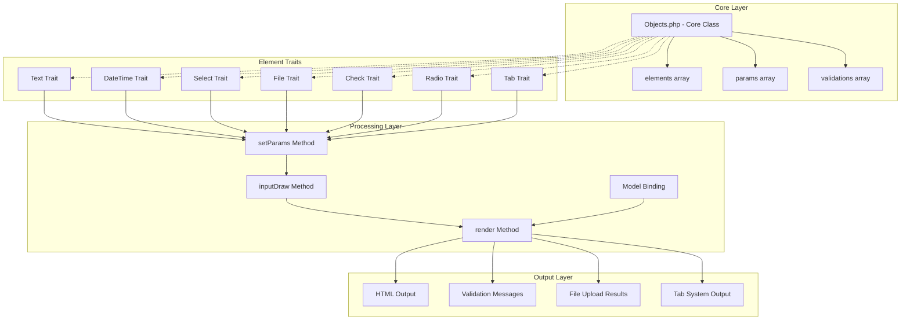
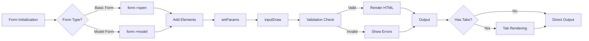

# Arsitektur Form System CanvaStack

## 🏗️ Overview Arsitektur

Form System CanvaStack menggunakan arsitektur berbasis **Trait Pattern** dengan **Composition** untuk mencapai fleksibilitas dan reusability yang tinggi.

## 📊 Diagram Arsitektur



## 🔄 Alur Data (Data Flow)



## 🧩 Komponen Utama

### 1. **Core Class (Objects.php)**

**Responsibilities:**
- Form lifecycle management (open, close)
- Element collection dan rendering
- Model binding dan data processing
- Validation handling
- Route detection dan path generation

**Key Properties:**
```php
public $elements = [];          // Container untuk semua form elements
public $params = [];            // Parameter untuk setiap element
public $validations = [];       // Validation rules
public $model;                  // Model binding object
private $currentRoute;          // Route information
```

### 2. **Element Traits**

Setiap trait bertanggung jawab untuk jenis input tertentu:

| Trait | Purpose | Methods |
|-------|---------|---------|
| **Text** | Text inputs, textarea, email, number, password, tags | `text()`, `textarea()`, `email()`, `number()`, `password()`, `tags()` |
| **DateTime** | Date/time related inputs | `date()`, `datetime()`, `daterange()`, `time()` |
| **Select** | Dropdown dan month picker | `selectbox()`, `month()` |
| **File** | File upload dengan thumbnails | `file()`, `fileUpload()`, `createThumbImage()` |
| **Check** | Checkboxes dan switches | `checkbox()`, `drawCheckBox()` |
| **Radio** | Radio buttons | `radiobox()`, `drawRadioBox()` |
| **Tab** | Tab system rendering | `openTab()`, `closeTab()`, `renderTab()` |

### 3. **Processing Pipeline**

**Step 1: Parameter Setting**
```php
setParams($function_name, $name, $value, $attributes, $label, $selected)
```
- Mengumpulkan semua parameter element
- Melakukan model value binding
- Menerapkan validation attributes

**Step 2: Input Drawing**
```php
inputDraw($function_name, $name)
```
- Membuat HTML wrapper (form-group)
- Menambahkan label dengan required indicator
- Memanggil inputTag untuk actual input

**Step 3: Rendering**
```php
render($object)
```
- Mengecek apakah ada tab system
- Melakukan final HTML assembly
- Return hasil akhir

## 🔧 Design Patterns Used

### 1. **Trait Pattern**
- **Purpose**: Code reusability tanpa inheritance complexity
- **Implementation**: Setiap jenis element adalah trait terpisah
- **Benefit**: Easy maintenance, clear separation of concerns

### 2. **Builder Pattern**
- **Purpose**: Step-by-step form construction
- **Implementation**: Method chaining untuk build forms
- **Example**: `$form->open()->text()->email()->close()`

### 3. **Template Method Pattern**
- **Purpose**: Consistent element rendering pipeline
- **Implementation**: `setParams()` → `inputDraw()` → `render()`
- **Benefit**: Uniformity across all elements

### 4. **Strategy Pattern**
- **Purpose**: Different rendering strategies per element type
- **Implementation**: `inputTag()` method dengan conditional logic
- **Benefit**: Extensible untuk new element types

## 🗃️ Data Structure

### Element Storage
```php
// Structure: elements[index] = html_string
$this->elements = [
    0 => '<form method="POST">...',
    1 => '<div class="form-group">...</div>',
    2 => '<button type="submit">...</button>'
];
```

### Parameter Storage
```php
// Structure: params[element_type][field_name] = config_array
$this->params = [
    'text' => [
        'username' => [
            'label' => 'Username',
            'value' => 'john_doe',
            'selected' => null,
            'attributes' => ['class' => 'form-control', 'required' => true]
        ]
    ]
];
```

### Validation Storage
```php
// Structure: validations[field_name] = rules
$this->validations = [
    'email' => 'required|email|unique:users',
    'password' => 'required|min:8|confirmed'
];
```

## 🔄 Lifecycle Hooks

### Form Lifecycle
1. **Initialization** → `__construct()`
2. **Opening** → `open()` or `model()`
3. **Element Addition** → `text()`, `email()`, etc.
4. **Closing** → `close()`
5. **Rendering** → `render()`

### Element Lifecycle
1. **Parameter Setting** → `setParams()`
2. **Value Binding** → `setModelValueAndSelectedToParams()`
3. **HTML Drawing** → `inputDraw()`
4. **Tag Generation** → `inputTag()`

## 🎯 Key Features

### Model Binding
- Automatic value population dari model
- Smart route detection untuk CRUD operations
- Soft delete support

### Dynamic Routing
- Auto-generate action URLs based on current route
- Support untuk `Route::resource()` pattern
- Custom path override capability

### Validation Integration
- Laravel validation rules support
- Visual required field indicators
- Error message display

### File Upload System
- Multiple file support
- Automatic thumbnail generation
- Configurable upload paths
- Image processing dengan Intervention Image

### Tab System
- Dynamic tab rendering
- Placeholder-based parsing
- Nested content support
- Bootstrap integration

## 📈 Performance Considerations

### Memory Management
- Element array menggunakan append pattern
- Lazy rendering untuk complex elements
- Efficient string concatenation

### Processing Optimization
- Single-pass rendering
- Minimal database queries untuk model binding
- Cached validation attributes

## 🔒 Security Features

### Input Sanitization
- Laravel built-in XSS protection
- Attribute escaping
- File upload validation

### CSRF Protection
- Automatic token insertion
- Laravel middleware integration

### Validation Security
- Server-side validation enforcement
- Type checking untuk attributes
- Safe file upload handling

---

**Next**: [Core System Documentation](./CORE_SYSTEM.md)