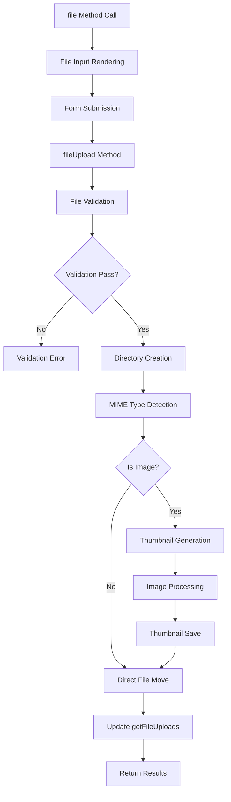

# File Upload System & Thumbnail Generation

## 🗂️ Overview

File Upload System CanvaStack menyediakan solusi upload file yang comprehensive dengan fitur-fitur advanced seperti thumbnail generation otomatis, validation terintegrasi, dan struktur direktori yang terorganisir. Sistem ini menggunakan Intervention Image untuk image processing dan Laravel File Storage.

## 🏗️ Architecture



## 📁 Directory Structure

### Auto-Generated Structure
```
uploads/
└── {upload_path}/
    └── YYYY/                 # Year
        └── MM/               # Month
            └── DD/           # Day
                ├── {timestamp}_{filename}.ext
                └── thumb/
                    └── tnail_{timestamp}_{filename}.ext
```

### Example Structure
```
public/
└── uploads/
    └── users/
        └── avatars/
            └── 2024/
                └── 03/
                    └── 15/
                        ├── 1710494400_profile.jpg      # Original file
                        └── thumb/
                            └── tnail_1710494400_profile.jpg  # Thumbnail
```

## 🎯 Core Methods

### File Input Element

#### `file($name, $attributes, $label)`
```php
public function file($name, $attributes = [], $label = true)
```

**Purpose**: Create file input dengan Bootstrap File Input styling  

**Attributes**:
- `imagepreview`: Enable image preview functionality
- `value`: Path ke existing file untuk preview

**Examples**:
```php
// Basic file upload
$form->file('document', [], 'Document');

// Image dengan preview
$form->file('avatar', ['imagepreview'], 'Profile Picture');

// Dengan existing file
$form->file('photo', [
    'imagepreview', 
    'value' => '/uploads/users/2024/03/15/1710494400_photo.jpg'
], 'Photo');
```

**Generated HTML (Image Preview)**:
```html
<div class="input-group col-sm-9">
    <div class="fileinput fileinput-new" data-provides="fileinput">
        <div id="avatar-fileinput-preview" class="fileinput-preview thumbnail" 
             data-trigger="fileinput" style="width: 198px; height: 150px;">
            
        </div>
        <div>
            <span class="btn btn-primary btn-file">
                <span class="fileinput-new">Select Image</span>
                <span class="fileinput-exists">Change</span>
                <input type="file" name="avatar">
            </span>
            <a href="#" class="btn btn-danger fileinput-exists" data-dismiss="fileinput">Remove</a>
        </div>
    </div>
</div>
```

**Generated HTML (Regular File)**:
```html
<div class="input-group col-sm-9">
    <div class="fileinput fileinput-new input-group" data-provides="fileinput">
        <div class="form-control" data-trigger="fileinput">
            <i class="glyphicon glyphicon-file fileinput-exists"></i> 
            <span class="fileinput-filename">document.pdf</span>
        </div>
        <span class="input-group-addon btn btn-primary btn-file">
            <span class="fileinput-new">Select File</span>
            <span class="fileinput-exists">Change</span>
            <input type="file" name="document">
        </span>
        <a href="#" class="input-group-addon btn btn-danger fileinput-exists" 
           data-dismiss="fileinput">Remove</a>
    </div>
</div>
```

### File Upload Processing

#### `fileUpload($upload_path, $request, $fileInfo)`
```php
public function fileUpload($upload_path, $request, $fileInfo)
```

**Purpose**: Process file upload dengan validation dan thumbnail generation  

**Parameters**:
- `$upload_path`: Base upload directory
- `$request`: Laravel Request object
- `$fileInfo`: File configuration array

**FileInfo Structure**:
```php
$fileInfo = [
    'field_name' => [
        'file_type' => 'image|document|any',
        'file_validation' => 'required|image|max:2048',
        'thumb_name' => 'thumbnail_prefix',
        'thumb_size' => [width, height] // [null, height] untuk aspect ratio
    ]
];
```

**Complete Example**:
```php
// Form setup
$form = new Objects();
$form->setValidations([
    'avatar' => 'required|image|mimes:jpeg,png,jpg|max:2048',
    'resume' => 'nullable|file|mimes:pdf,doc,docx|max:5120'
]);

$form->modelWithFile($user);
$form->file('avatar', ['imagepreview'], 'Profile Picture');
$form->file('resume', [], 'Resume');
$form->close('Update Profile');

// Controller processing
public function update(Request $request, $id)
{
    $user = User::findOrFail($id);
    
    $fileInfo = [
        'avatar' => [
            'file_type' => 'image',
            'file_validation' => 'required|image|max:2048',
            'thumb_name' => 'avatar_thumb',
            'thumb_size' => [200, 200]
        ],
        'resume' => [
            'file_type' => 'document',
            'file_validation' => 'nullable|mimes:pdf,doc,docx|max:5120',
            'thumb_name' => null,
            'thumb_size' => null
        ]
    ];
    
    // Process upload
    $form = new Objects();
    $form->fileUpload('users/profile', $request, $fileInfo);
    
    // Get upload results
    $uploadedFiles = $form->getFileUploads;
    
    // Update user dengan file paths
    if (isset($uploadedFiles['avatar']['file'])) {
        $user->avatar = $uploadedFiles['avatar']['file'];
        $user->avatar_thumbnail = $uploadedFiles['avatar']['thumbnail'] ?? null;
    }
    
    if (isset($uploadedFiles['resume']['file'])) {
        $user->resume = $uploadedFiles['resume']['file'];
    }
    
    $user->save();
    
    return redirect()->back()->with('message', 'Profile updated successfully!');
}
```

## 🖼️ Thumbnail Generation System

### Thumbnail Processing

#### `createThumbImage($request, $inputname, $dataInfo, $upload_path)`
```php
private function createThumbImage($request, $inputname, $dataInfo, $upload_path)
```

**Purpose**: Generate thumbnail untuk image files  
**Features**:
- Automatic aspect ratio preservation
- Configurable dimensions
- Support untuk Intervention Image v2 & v3
- Quality optimization

**Processing Flow**:
1. **Path Setup**: Create thumbnail directory
2. **Image Loading**: Load original image
3. **Size Calculation**: Calculate optimal dimensions
4. **Resize**: Apply resize dengan aspect ratio
5. **Save**: Save thumbnail dengan naming convention

**Thumbnail Configuration**:
```php
$dataInfo = [
    'thumb_name' => 'prefix_name',
    'thumb_size' => [width, height]
];

// Examples:
// [200, 200]    - Max 200x200, maintain aspect ratio
// [null, 150]   - Height 150, auto width
// [300, null]   - Width 300, auto height
```

**Intervention Image Integration**:
```php
// v3 (preferred)
if (method_exists($thumbfile, 'scaleDown')) {
    $thumbfile->scaleDown(
        width: $tw ?? null,
        height: $th ?? null
    );
}

// v2 fallback
else {
    $thumbfile->resize($tw, $th, function ($constraint) {
        $constraint->aspectRatio();
        $constraint->upsize();
    });
}
```

### Thumbnail Examples

#### Square Thumbnails
```php
$fileInfo = [
    'avatar' => [
        'thumb_size' => [150, 150],  // Perfect square
        'thumb_name' => 'avatar_thumb'
    ]
];

// Result: 150x150 thumbnail dengan aspect ratio preserved
```

#### Responsive Thumbnails
```php
$fileInfo = [
    'banner' => [
        'thumb_size' => [800, null],  // Width 800, auto height
        'thumb_name' => 'banner_thumb'
    ],
    'portrait' => [
        'thumb_size' => [null, 400],  // Auto width, height 400
        'thumb_name' => 'portrait_thumb'
    ]
];
```

#### Multiple Thumbnail Sizes
```php
// Custom implementation untuk multiple sizes
public function createMultipleThumbnails($request, $inputname, $sizes, $upload_path)
{
    $form = new Objects();
    $thumbnails = [];
    
    foreach ($sizes as $size_name => $dimensions) {
        $fileInfo = [
            $inputname => [
                'thumb_size' => $dimensions,
                'thumb_name' => "{$inputname}_{$size_name}"
            ]
        ];
        
        // Process thumbnail
        $form->fileUpload($upload_path, $request, $fileInfo);
        $thumbnails[$size_name] = $form->getFileUploads[$inputname]['thumbnail'];
    }
    
    return $thumbnails;
}

// Usage
$thumbnailSizes = [
    'small' => [100, 100],
    'medium' => [300, 300],
    'large' => [800, 800]
];

$thumbnails = $this->createMultipleThumbnails($request, 'photo', $thumbnailSizes, 'gallery');
```

## 🔧 Internal Methods

### Path Management

#### `setUploadPath($folder_name)`
```php
private function setUploadPath($folder_name)
```

**Purpose**: Generate absolute upload path  
**Logic**:
```php
$baseFileUpload = canvastack_config('base_resources'); // 'uploads'
return public_path("{$baseFileUpload}/{$folder_name}");
```

#### `setAssetPath($path, $folder)`
```php
private function setAssetPath($path, $folder)
```

**Purpose**: Convert absolute path ke relative URL  
**Logic**:
```php
$baseIndexFolder = canvastack_config('index_folder'); // 'public'
$basePathURL = explode($baseIndexFolder, str_replace('\\', '/', $path));
return "{$baseIndexFolder}{$endBasePathURL}/{$folder}";
```

### File Processing

#### `getFileType($request, $input_name)`
```php
private function getFileType($request, $input_name)
```

**Purpose**: Detect MIME type dan extract file type  
**Returns**: `image`, `video`, `document`, `audio`, etc.

```php
$mimeType = $request->file($input_name)->getMimeType(); // 'image/jpeg'
$getType = explode('/', $mimeType);                     // ['image', 'jpeg']
return strtolower($getType[0]);                         // 'image'
```

#### `validationFile($request, $input_name, $validation)`
```php
private function validationFile($request, $input_name, $validation)
```

**Purpose**: Apply file-specific validation rules  
**Integration**: Laravel validation system

### Upload Pipeline

#### `fileUploadProcessor($request, $upload_path, $fileInfo, $use_time)`
```php
private function fileUploadProcessor($request, $upload_path, $fileInfo, $use_time = true)
```

**Complete Upload Process**:
1. **Path Generation**: Create upload directory structure
2. **Time-based Naming**: Generate unique filenames
3. **Validation**: Apply file validation rules
4. **MIME Detection**: Determine file type
5. **Thumbnail**: Generate thumbnails untuk images
6. **File Move**: Move file ke final destination
7. **Results**: Update `getFileUploads` array

**Naming Convention**:
```php
if (true === $use_time) {
    $str_time = time() . '_';                    // Unix timestamp
    $datePath = date('Y') . '/' . date('m') . '/' . date('d');  // YYYY/MM/DD
}

$filename = $str_time . $file->getClientOriginalName();
// Result: 1710494400_original_filename.jpg
```

## 📊 Upload Results

### `getFileUploads` Structure
```php
// Single file result
$form->getFileUploads = [
    'avatar' => [
        'file' => '/uploads/users/2024/03/15/1710494400_avatar.jpg',
        'thumbnail' => '/uploads/users/2024/03/15/thumb/tnail_1710494400_avatar.jpg'
    ]
];

// Multiple files result
$form->getFileUploads = [
    'avatar' => [
        'file' => '/uploads/users/2024/03/15/1710494400_avatar.jpg',
        'thumbnail' => '/uploads/users/2024/03/15/thumb/tnail_1710494400_avatar.jpg'
    ],
    'resume' => [
        'file' => '/uploads/documents/2024/03/15/1710494400_resume.pdf'
        // No thumbnail untuk non-image files
    ]
];
```

### Result Processing
```php
// Controller processing upload results
$uploadedFiles = $form->getFileUploads;

foreach ($uploadedFiles as $field => $fileData) {
    if (isset($fileData['file'])) {
        $model->{$field} = $fileData['file'];
        
        // Save thumbnail path jika ada
        if (isset($fileData['thumbnail'])) {
            $model->{$field . '_thumbnail'} = $fileData['thumbnail'];
        }
    }
}

$model->save();
```

## 💾 Configuration Examples

### Basic File Upload
```php
// Simple document upload
$fileInfo = [
    'document' => [
        'file_validation' => 'required|mimes:pdf,doc,docx|max:10240'
    ]
];

$form->fileUpload('documents', $request, $fileInfo);
```

### Image dengan Multiple Thumbnails
```php
// Custom class untuk handle multiple thumbnails
class FileUploadManager extends Objects
{
    public function processImageWithThumbnails($field, $request, $path, $thumbnailSizes = [])
    {
        if (!$request->hasFile($field)) {
            return null;
        }

        $results = [
            'original' => null,
            'thumbnails' => []
        ];

        // Upload original
        $fileInfo = [$field => ['file_validation' => 'required|image|max:2048']];
        $this->fileUpload($path, $request, $fileInfo);
        $results['original'] = $this->getFileUploads[$field]['file'] ?? null;

        // Generate multiple thumbnails
        foreach ($thumbnailSizes as $size => $dimensions) {
            $thumbInfo = [
                $field => [
                    'thumb_size' => $dimensions,
                    'thumb_name' => "{$field}_{$size}"
                ]
            ];
            
            $this->createThumbImage($request, $field, $thumbInfo[$field], $path);
            $results['thumbnails'][$size] = $this->getFileUploads[$field]['thumbnail'] ?? null;
        }

        return $results;
    }
}

// Usage
$manager = new FileUploadManager();
$results = $manager->processImageWithThumbnails('gallery_image', $request, 'gallery', [
    'thumb' => [150, 150],
    'medium' => [400, 300],
    'large' => [800, 600]
]);

// Save to database
$gallery = new Gallery();
$gallery->image = $results['original'];
$gallery->thumb = $results['thumbnails']['thumb'];
$gallery->medium = $results['thumbnails']['medium'];
$gallery->large = $results['thumbnails']['large'];
$gallery->save();
```

## 🔒 Security Considerations

### File Validation
```php
// Comprehensive validation rules
$fileInfo = [
    'avatar' => [
        'file_validation' => [
            'required',
            'image',
            'mimes:jpeg,png,jpg,gif',
            'max:2048',                    // 2MB max
            'dimensions:min_width=100,min_height=100,max_width=2000,max_height=2000'
        ]
    ]
];
```

### MIME Type Verification
```php
// Additional security check
public function validateMimeType($file, $allowedTypes = [])
{
    $mimeType = $file->getMimeType();
    $extension = $file->getClientOriginalExtension();
    
    // Verify MIME type matches extension
    $mimeToExt = [
        'image/jpeg' => ['jpg', 'jpeg'],
        'image/png' => ['png'],
        'application/pdf' => ['pdf']
    ];
    
    if (isset($mimeToExt[$mimeType])) {
        return in_array(strtolower($extension), $mimeToExt[$mimeType]);
    }
    
    return false;
}
```

### Directory Security
```php
// Prevent directory traversal
public function sanitizePath($path)
{
    // Remove dangerous characters
    $path = str_replace(['../', '.\\', '..\\'], '', $path);
    
    // Ensure path is within upload directory
    $basePath = public_path('uploads');
    $fullPath = realpath($basePath . '/' . $path);
    
    if (!$fullPath || strpos($fullPath, $basePath) !== 0) {
        throw new \InvalidArgumentException('Invalid upload path');
    }
    
    return $path;
}
```

## 🚀 Performance Optimization

### Image Optimization
```php
// Optimize image quality
public function optimizeImage($imagePath, $quality = 85)
{
    $manager = new ImageManager(new Driver());
    $image = $manager->read($imagePath);
    
    // Reduce quality untuk smaller file size
    $image->encode('jpg', $quality);
    $image->save($imagePath);
    
    return $imagePath;
}
```

### Lazy Loading
```php
// Generate thumbnails on-demand
public function getThumbnail($originalPath, $size = [150, 150])
{
    $thumbnailPath = $this->generateThumbnailPath($originalPath, $size);
    
    if (!file_exists($thumbnailPath)) {
        $this->createThumbnailOnDemand($originalPath, $thumbnailPath, $size);
    }
    
    return $thumbnailPath;
}
```

---

**Next**: [Tab System Documentation](./TAB_SYSTEM.md)