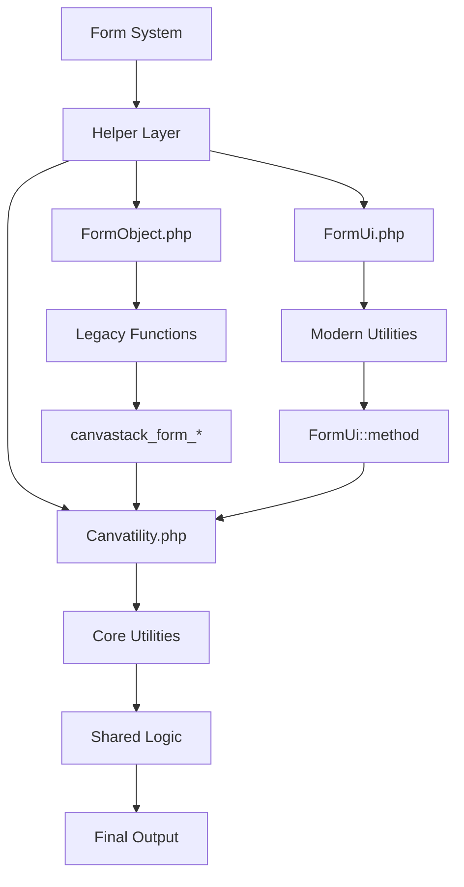

# Helper Functions & Utilities

## 🛠️ Overview

Form System CanvaStack menyediakan ekosistem helper functions dan utility classes untuk mempermudah development. Sistem ini terbagi menjadi dua layer utama: **FormObject helpers** (legacy functions) dan **FormUi utilities** (modern implementation) yang memberikan flexibility dan backward compatibility.

## 📁 Architecture



## 📝 FormObject Helper Functions

**Location**: `src/Library/Helpers/FormObject.php`  
**Purpose**: Global helper functions untuk backward compatibility dan ease of use

### Attribute Management

#### `canvastack_form_check_str_attr($attributes, $string)`
```php
function canvastack_form_check_str_attr($attributes, $string)
```

**Purpose**: Check jika string tertentu ada dalam class atau id attribute  
**Returns**: `true` jika ditemukan, `false` jika tidak  
**Use Case**: Detect plugin atau styling classes

**Example**:
```php
$attributes = ['class' => 'form-control ckeditor', 'id' => 'content_editor'];

// Check CKEditor
if (canvastack_form_check_str_attr($attributes, 'ckeditor')) {
    $this->element_plugins[$name] = 'ckeditor';
}

// Check specific ID
if (canvastack_form_check_str_attr($attributes, 'editor')) {
    // Special handling for editor fields
}
```

#### `canvastack_form_change_input_attribute($attribute, $key, $value)`
```php
function canvastack_form_change_input_attribute($attribute, $key = false, $value = false)
```

**Purpose**: Add atau merge attributes dengan handling khusus untuk class merging  
**Delegation**: Menggunakan `Canvatility::formChangeInputAttribute()`

**Example**:
```php
$attributes = ['class' => 'form-control'];

// Add additional class
$attributes = canvastack_form_change_input_attribute($attributes, 'class', 'date-picker');
// Result: ['class' => 'form-control date-picker']

// Add other attributes
$attributes = canvastack_form_change_input_attribute($attributes, 'data-toggle', 'datepicker');
// Result: ['class' => 'form-control date-picker', 'data-toggle' => 'datepicker']
```

#### `canvastack_form_set_icon_attributes($string, $attributes, $pos)`
```php
function canvastack_form_set_icon_attributes($string, $attributes = [], $pos = 'left')
```

**Purpose**: Parse icon configuration dari field name format  
**Format**: `field_name|icon_name|position`  
**Returns**: Array `['name' => clean_name, 'data' => icon_config]`

**Example**:
```php
// Parse icon from name
$result = canvastack_form_set_icon_attributes('username|user|left', []);
// Result: ['name' => 'username', 'data' => [...icon config...]]

// In form usage
$form->text('password|lock|right', null, [], 'Password');
```

### UI Component Helpers

#### `canvastack_form_button($name, $label, $action, $tag, $link, $color, $border, $size, $disabled, $icon_name, $icon_color)`
```php
function canvastack_form_button($name, $label = false, $action = [], $tag = 'button', ...)
```

**Purpose**: Generate custom buttons dengan styling dan icons  
**Delegation**: `Canvatility::formButton()`

**Parameters**:
- `$name`: Button name/class suffix
- `$label`: Button text
- `$action`: Additional attributes
- `$tag`: HTML tag (button, a, input)
- `$link`: URL for anchor tags
- `$color`: Bootstrap color (primary, success, danger, etc.)
- `$border`: Border style
- `$size`: Button size
- `$disabled`: Disabled state
- `$icon_name`: FontAwesome icon name
- `$icon_color`: Icon color class

**Example**:
```php
// Basic button
echo canvastack_form_button('save', 'Save Changes', [], 'button', false, 'success');

// Button dengan icon
echo canvastack_form_button('delete', 'Delete', [
    'onclick' => 'return confirm("Are you sure?")'
], 'button', false, 'danger', false, false, false, 'trash', 'white');

// Link button
echo canvastack_form_button('edit', 'Edit Profile', [], 'a', '/profile/edit', 'primary', false, false, false, 'edit');
```

**Generated HTML**:
```html
<!-- Basic button -->
<button class="btn btn-success btn-save">Save Changes</button>

<!-- Button dengan icon -->
<button class="btn btn-danger btn-delete" onclick="return confirm('Are you sure?')">
    <i class="fa fa-trash bigger-120 white"></i>&nbsp; Delete
</button>

<!-- Link button -->
<a href="/profile/edit" class="btn btn-primary btn-edit">
    <i class="fa fa-edit bigger-120"></i>&nbsp; Edit Profile
</a>
```

#### `canvastack_form_checkList($name, $value, $label, $checked, $class, $id, $inputNode)`
```php
function canvastack_form_checkList($name, $value = false, $label = false, $checked = false, $class = 'success', $id = false, $inputNode = null)
```

**Purpose**: Generate single checkbox dengan Bootstrap styling  
**Use Case**: Quick checkbox creation tanpa form builder

**Example**:
```php
// Basic checkbox
echo canvastack_form_checkList('agree', 1, 'I agree to terms', false, 'success');

// Checked checkbox dengan custom ID
echo canvastack_form_checkList('newsletter', 1, 'Subscribe to newsletter', true, 'primary', 'newsletter_checkbox');

// Dengan additional attributes
echo canvastack_form_checkList('remember', 1, 'Remember me', false, 'info', false, 'data-toggle="tooltip"');
```

**Generated HTML**:
```html
<div class="ckbox ckbox-success">
    <input type="checkbox" value="1" name="agree" id="agree">
    <label for="agree">&nbsp; I agree to terms</label>
</div>
```

#### `canvastack_form_selectbox($name, $values, $selected, $attributes, $label, $set_first_value)`
```php
function canvastack_form_selectbox($name, $values = [], $selected = false, $attributes = [], $label = true, $set_first_value = [null => 'Select'])
```

**Purpose**: Generate select box dengan Chosen.js styling  
**Use Case**: Standalone select tanpa form builder

**Example**:
```php
$countries = [
    'ID' => 'Indonesia',
    'MY' => 'Malaysia', 
    'SG' => 'Singapore'
];

// Basic select
echo canvastack_form_selectbox('country', $countries, 'ID');

// Multiple select
echo canvastack_form_selectbox('skills[]', $skills, [1, 3, 5], ['multiple'], 'Skills');

// Custom first option
echo canvastack_form_selectbox('category', $categories, null, [], 'Category', ['' => 'Choose Category']);
```

### Status & Configuration Helpers

#### `canvastack_form_active_box($en)`
```php
function canvastack_form_active_box($en = true)
```

**Purpose**: Generate active/inactive options untuk select box  
**Parameter**: `$en` - Language (true = English, false = Bahasa Indonesia)

**Example**:
```php
// English version
$options = canvastack_form_active_box(true);
// Result: [0 => 'No', 1 => 'Yes']

// Indonesian version
$options = canvastack_form_active_box(false);
// Result: [0 => 'Tidak', 1 => 'Ya']

// Usage dalam selectbox
$form->selectbox('is_active', canvastack_form_active_box(), 1, [], 'Status');
```

#### `canvastack_form_request_status($en, $num)`
```php
function canvastack_form_request_status($en = true, $num = false)
```

**Purpose**: Generate request status options  
**Parameters**:
- `$en`: Language preference
- `$num`: Return numeric values atau text

**Example**:
```php
// Text values (English)
$options = canvastack_form_request_status(true, false);
// Result: ['Pending', 'Accept', 'Blocked', 'Banned']

// Numeric values
$options = canvastack_form_request_status(true, true);
// Result: [0 => 'Pending', 1 => 'Accept', 2 => 'Blocked', 3 => 'Banned']
```

#### `canvastack_form_set_active_value($value)`
```php
function canvastack_form_set_active_value($value)
```

**Purpose**: Convert numeric value ke human-readable active status  

**Example**:
```php
echo canvastack_form_set_active_value(1);  // "Active"
echo canvastack_form_set_active_value(0);  // "Inactive"
```

### Message & Alert Helpers

#### `canvastack_form_alert_message($message, $type, $title, $prefix, $extra)`
```php
function canvastack_form_alert_message($message = 'Success', $type = 'success', $title = 'Success', $prefix = 'fa-check', $extra = false)
```

**Purpose**: Generate Bootstrap alert messages  
**Delegation**: `Canvatility::formAlertMessage()`

**Parameters**:
- `$message`: Message content atau array untuk validation errors
- `$type`: Alert type (success, warning, danger, info)
- `$title`: Alert title
- `$prefix`: FontAwesome icon
- `$extra`: Additional HTML content

**Example**:
```php
// Success message
echo canvastack_form_alert_message('User created successfully!', 'success', 'Success', 'fa-check');

// Warning message
echo canvastack_form_alert_message('Please check your input', 'warning', 'Warning', 'fa-exclamation-triangle');

// Validation errors
$errors = [
    'email' => ['Email is required', 'Email format invalid'],
    'name' => ['Name is required']
];
echo canvastack_form_alert_message($errors, 'danger', 'Validation Error', 'fa-times');
```

### Tab System Helpers

#### `canvastack_form_create_header_tab($data, $pointer, $active, $class)`
```php
function canvastack_form_create_header_tab($data, $pointer, $active = false, $class = false)
```

**Purpose**: Generate tab navigation header  
**Used by**: Tab rendering system

**Parameters**:
- `$data`: Tab title
- `$pointer`: Tab ID/href
- `$active`: Active state class
- `$class`: Icon class

**Example**:
```php
echo canvastack_form_create_header_tab('Personal Info', 'personalinfo', 'active', 'fa-user');
```

**Generated HTML**:
```html
<li class="nav-item">
    <a class="nav-link active" data-toggle="tab" role="tab" href="#personalinfo">
        <i class="fa-user"></i>Personal Info
    </a>
</li>
```

#### `canvastack_form_create_content_tab($data, $pointer, $active)`
```php
function canvastack_form_create_content_tab($data, $pointer, $active = false)
```

**Purpose**: Generate tab content pane  

**Example**:
```php
echo canvastack_form_create_content_tab('<div>Content here</div>', 'personalinfo', 'in active');
```

**Generated HTML**:
```html
<div id="personalinfo" class="tab-pane fade in active" role="tabpanel">
    <div>Content here</div>
</div>
```

### Utility Helpers

#### `canvastack_form_get_client_ip()`
```php
function canvastack_form_get_client_ip()
```

**Purpose**: Get real client IP address dengan proxy detection  
**Returns**: IP address string

**Example**:
```php
$clientIP = canvastack_form_get_client_ip();
// Result: "192.168.1.100" atau actual client IP

// Usage in logging
Log::info('Form submitted from IP: ' . canvastack_form_get_client_ip());
```

#### `canvastack_selectbox($object, $key_value, $key_label, $set_null_array)`
```php
function canvastack_selectbox($object, $key_value, $key_label, $set_null_array = true)
```

**Purpose**: Convert object/array collection ke select options  
**Use Case**: Transform Eloquent collections atau arrays

**Example**:
```php
// Eloquent collection
$users = User::all();
$options = canvastack_selectbox($users, 'id', 'name');
// Result: [1 => 'John Doe', 2 => 'Jane Smith', ...]

// Array collection
$data = [
    ['code' => 'ID', 'country' => 'Indonesia'],
    ['code' => 'MY', 'country' => 'Malaysia']
];
$options = canvastack_selectbox($data, 'code', 'country');
// Result: ['ID' => 'Indonesia', 'MY' => 'Malaysia']

// Tanpa null option
$options = canvastack_selectbox($users, 'id', 'name', false);
```

## 🏛️ FormUi Utility Class

**Location**: `src/Library/Components/Utility/Html/FormUi.php`  
**Purpose**: Modern utility class dengan static methods untuk consistent output

### UI Builders

#### `FormUi::button($name, $label, $action, $tag, $link, $color, $border, $size, $disabled, $icon_name, $icon_color)`
```php
public static function button($name, $label = false, $action = [], ...)
```

**Purpose**: Modern button builder dengan legacy parity  
**Returns**: HTML string

**Example**:
```php
use Canvastack\Canvastack\Library\Components\Utility\Html\FormUi;

// Generate button
$html = FormUi::button('submit', 'Save Changes', [
    'onclick' => 'validateForm()'
], 'button', false, 'primary', false, false, false, 'save');

echo $html;
```

#### `FormUi::checkList($name, $value, $label, $checked, $class, $id, $inputNode)`
```php
public static function checkList($name, $value = false, ...)
```

**Purpose**: Generate checkbox dengan Bootstrap styling  

**Example**:
```php
$checkbox = FormUi::checkList('terms', 1, 'I agree to terms and conditions', true, 'success');
echo $checkbox;
```

#### `FormUi::selectbox($name, $values, $selected, $attributes, $label, $set_first_value)`
```php
public static function selectbox($name, $values = [], ...)
```

**Purpose**: Generate select element dengan fallback untuk Laravel Collective  

**Features**:
- Laravel Collective integration
- Fallback manual HTML generation
- Chosen.js classes auto-applied

**Example**:
```php
$select = FormUi::selectbox('country', $countries, 'ID', [
    'class' => 'custom-class',
    'data-placeholder' => 'Choose country'
]);
```

#### `FormUi::alertMessage($message, $type, $title, $prefix, $extra)`
```php
public static function alertMessage($message = 'Success', ...)
```

**Purpose**: Generate Bootstrap alert dengan support untuk validation arrays  

**Example**:
```php
// Simple alert
$alert = FormUi::alertMessage('Operation successful!', 'success');

// Complex validation alert
$errors = ['field' => ['Error message']];
$alert = FormUi::alertMessage($errors, 'danger', 'Validation Failed');
```

### Tab Utilities

#### `FormUi::createHeaderTab($data, $pointer, $active, $class)`
```php
public static function createHeaderTab($data, $pointer, $active = false, $class = false)
```

**Purpose**: Generate tab header dengan icon support  

**Example**:
```php
$header = FormUi::createHeaderTab('Settings', 'settings', 'active', 'fa-cog');
// Returns: <li class="nav-item"><a class="nav-link active"...>
```

#### `FormUi::createContentTab($data, $pointer, $active)`
```php
public static function createContentTab($data, $pointer, $active = false)
```

**Purpose**: Generate tab content pane  

**Example**:
```php
$content = FormUi::createContentTab($formFields, 'settings', 'active show');
// Returns: <div id="settings" class="tab-pane fade active show"...>
```

### Attribute Management

#### `FormUi::changeInputAttribute($attribute, $key, $value)`
```php
public static function changeInputAttribute($attribute, $key = false, $value = false)
```

**Purpose**: Add atau merge attributes dengan class handling  

**Logic**:
1. Merge new attribute dengan existing
2. Handle array values untuk class attributes
3. Implode array values dengan spaces
4. Return merged attributes

**Example**:
```php
$attrs = ['class' => 'form-control'];
$attrs = FormUi::changeInputAttribute($attrs, 'class', 'date-picker');
// Result: ['class' => 'form-control date-picker']

$attrs = FormUi::changeInputAttribute($attrs, 'data-toggle', 'datepicker');
// Result: ['class' => 'form-control date-picker', 'data-toggle' => 'datepicker']
```

## 🔧 Integration Patterns

### Form Builder Integration
```php
class CustomFormBuilder extends Objects
{
    public function customButton($name, $label, $action = [])
    {
        // Using helper function
        $button = canvastack_form_button($name, $label, $action, 'button', false, 'primary', false, false, false, 'plus');
        $this->draw($button);
        
        return $this;
    }
    
    public function statusSelect($name, $selected = null)
    {
        // Using status helper
        $options = canvastack_form_active_box(true);
        $this->selectbox($name, $options, $selected, [], 'Status');
        
        return $this;
    }
}

// Usage
$form = new CustomFormBuilder();
$form->model($user);
$form->text('name');
$form->statusSelect('is_active', $user->is_active);
$form->customButton('save', 'Save Changes');
$form->close(false); // No default button
```

### Direct Helper Usage
```php
// Outside form builder context
class UserController extends Controller
{
    public function showStatus($user)
    {
        // Generate status badge
        $statusOptions = canvastack_form_active_box();
        $statusText = $statusOptions[$user->is_active];
        
        // Generate action buttons
        $editButton = canvastack_form_button('edit', 'Edit', [], 'a', 
            route('users.edit', $user), 'primary', false, false, false, 'edit');
            
        $deleteButton = canvastack_form_button('delete', 'Delete', [
            'onclick' => 'return confirm("Delete this user?")'
        ], 'button', false, 'danger', false, false, false, 'trash');
        
        return view('users.show', compact('user', 'statusText', 'editButton', 'deleteButton'));
    }
}
```

### Validation Messages Integration
```php
class FormValidationHandler
{
    public function handleValidationErrors($validator)
    {
        if ($validator->fails()) {
            // Convert Laravel errors ke helper format
            $errors = $validator->errors()->toArray();
            
            // Generate alert using helper
            $alertHtml = canvastack_form_alert_message(
                $errors, 
                'danger', 
                'Validation Error', 
                'fa-exclamation-triangle'
            );
            
            return response()->json([
                'status' => 'error',
                'html' => $alertHtml
            ]);
        }
    }
}
```

## 🎯 Custom Helper Development

### Creating Custom Helpers
```php
// File: app/Helpers/CustomFormHelpers.php

if (!function_exists('custom_form_status_badge')) {
    /**
     * Generate status badge untuk user
     */
    function custom_form_status_badge($status, $size = 'normal')
    {
        $classes = [
            'active' => 'badge-success',
            'inactive' => 'badge-secondary',
            'pending' => 'badge-warning',
            'banned' => 'badge-danger'
        ];
        
        $sizeClass = $size === 'large' ? 'badge-lg' : '';
        $badgeClass = $classes[$status] ?? 'badge-secondary';
        
        return "<span class=\"badge {$badgeClass} {$sizeClass}\">" . 
               ucwords($status) . 
               "</span>";
    }
}

if (!function_exists('custom_form_action_buttons')) {
    /**
     * Generate standard action buttons untuk CRUD
     */
    function custom_form_action_buttons($model, $permissions = [])
    {
        $buttons = [];
        
        if (in_array('view', $permissions)) {
            $buttons[] = canvastack_form_button('view', 'View', [], 'a',
                route(get_class($model) . '.show', $model->id), 'info', false, false, false, 'eye');
        }
        
        if (in_array('edit', $permissions)) {
            $buttons[] = canvastack_form_button('edit', 'Edit', [], 'a',
                route(get_class($model) . '.edit', $model->id), 'primary', false, false, false, 'edit');
        }
        
        if (in_array('delete', $permissions)) {
            $buttons[] = canvastack_form_button('delete', 'Delete', [
                'onclick' => 'return confirm("Are you sure?")',
                'data-id' => $model->id
            ], 'button', false, 'danger', false, false, false, 'trash');
        }
        
        return '<div class="btn-group">' . implode('', $buttons) . '</div>';
    }
}
```

### Helper Registration
```php
// File: app/Providers/HelperServiceProvider.php

class HelperServiceProvider extends ServiceProvider
{
    public function boot()
    {
        // Load custom helpers
        if (file_exists(app_path('Helpers/CustomFormHelpers.php'))) {
            require_once app_path('Helpers/CustomFormHelpers.php');
        }
    }
}
```

## 🔍 Debugging Helpers

### Helper Function Testing
```php
// Test helper functions output
public function testHelpers()
{
    // Test button generation
    $button = canvastack_form_button('test', 'Test Button', [], 'button', false, 'primary');
    dump('Button HTML:', $button);
    
    // Test checkbox
    $checkbox = canvastack_form_checkList('test', 1, 'Test Checkbox', true);
    dump('Checkbox HTML:', $checkbox);
    
    // Test alert
    $alert = canvastack_form_alert_message('Test message', 'success');
    dump('Alert HTML:', $alert);
    
    // Test attribute merging
    $attrs = canvastack_form_change_input_attribute(['class' => 'test'], 'class', 'new-class');
    dump('Merged attributes:', $attrs);
}
```

### Performance Monitoring
```php
class HelperPerformanceMonitor
{
    private static $timings = [];
    
    public static function startTiming($function)
    {
        self::$timings[$function] = microtime(true);
    }
    
    public static function endTiming($function)
    {
        if (isset(self::$timings[$function])) {
            $duration = microtime(true) - self::$timings[$function];
            Log::info("Helper function {$function} took {$duration}s");
        }
    }
}

// Usage dalam helper functions
function canvastack_form_button_monitored(...$args)
{
    HelperPerformanceMonitor::startTiming('canvastack_form_button');
    $result = canvastack_form_button(...$args);
    HelperPerformanceMonitor::endTiming('canvastack_form_button');
    
    return $result;
}
```

---

**Next**: [Usage Guide](./USAGE_GUIDE.md)