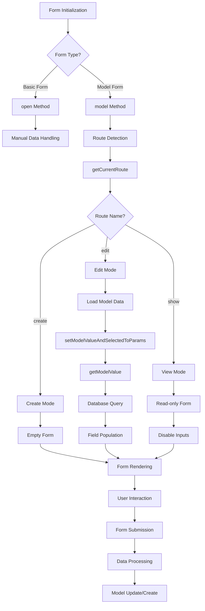

# Model Binding & Data Flow

## 🔄 Overview

Model Binding adalah salah satu fitur paling powerful dalam Form System CanvaStack yang memungkinkan automatic data population dan seamless integration dengan Laravel Eloquent models. Sistem ini mendeteksi context form (create/edit/show) dan secara otomatis mengatur data flow yang sesuai.

## 🏗️ Data Flow Architecture



## 🎯 Core Methods

### Model Binding Initialization

#### `model($model, $row_selected, $path, $file, $type)`
```php
public function model($model = null, $row_selected = false, $path = false, $file = false, $type = false)
```

**Purpose**: Menginisialisasi form dengan model binding untuk CRUD operations  

**Parameters**:
- `$model`: Eloquent model instance, class name, atau null (auto-detect dari `$this->model`)
- `$row_selected`: ID untuk edit mode (auto-detect dari URL jika false)  
- `$path`: Custom action path (auto-generate jika false)
- `$file`: File upload support (false default)
- `$type`: URL type ('route', 'action', 'url')

**Processing Logic**:
```php
// 1. Route detection dan context setup
if ('show' !== $this->currentRouteName) {
    // Extract ID from URL for edit mode
    if (str_contains(current_route(), 'edit')) {
        $sliceURL = explode('/', canvastack_current_url());
        unset($sliceURL[array_key_last($sliceURL)]);
        $row_selected = intval($sliceURL[array_key_last($sliceURL)]);
    }
    
    // 2. Model resolution
    if (empty($model)) {
        $modelData = null;
        if (!empty($this->model)) {
            if (is_string($this->model)) {
                $modelData = new $this->model();
            } else {
                $modelData = $this->model;
            }
        }
        
        // Load specific record for edit
        if (!empty($row_selected)) {
            $model = $modelData->find($row_selected);
        } else {
            $model = $modelData;
        }
    }
    
    // 3. Path generation
    if (false === $path) {
        $path = $this->setActionRoutePath();
    }
    
    // 4. Form attributes setup
    $model_path = $this->resolveModelPath($model);
    $model_uri = $this->generateSecureModelUri($model_path);
    $model_enc = encrypt($model_uri);
    
    // 5. Form creation with Laravel Collective
    $attr = $this->buildFormAttributes($type, $path, $row_selected, $model_enc, $file);
    $this->identity = $model_enc;
    $this->draw(Form::model($model, $attr));
}
```

### Route Detection System

#### `getCurrentRoute()`
```php
protected function getCurrentRoute()
```

**Purpose**: Mendeteksi current route dan menentukan form context  

**Process**:
```php
$this->currentRoute = current_route(); // e.g., "users.edit"
$this->currentRouteArray = explode('.', $this->currentRoute); // ["users", "edit"]
$this->currentRouteName = last($this->currentRouteArray); // "edit"
```

**Route Mapping**:
| Route Pattern | Context | Description |
|---------------|---------|-------------|
| `*.create` | Create Mode | Empty form untuk data baru |
| `*.edit` | Edit Mode | Form dengan data existing |
| `*.show` | View Mode | Read-only form display |
| Other | Default | Basic form handling |

#### `setActionRoutePath()`
```php
private function setActionRoutePath()
```

**Purpose**: Auto-generate form action URL berdasarkan current route  

**Logic**:
```php
if (str_contains(current_route(), '.create')) {
    // users.create → users.store
    return str_replace('.create', '.store', current_route());
} elseif (str_contains(current_route(), '.edit')) {
    // users.edit → users.update  
    return str_replace('.edit', '.update', current_route());
} else {
    return current_route();
}
```

## 📊 Data Flow Scenarios

### Scenario 1: Create Mode
```php
// Route: /users/create
// Current Route: users.create
// Form Context: Create Mode

$form = new Objects();
$form->model(User::class); // Empty model instance

// Data Flow:
// 1. currentRouteName = 'create'
// 2. model = new User() (empty instance)
// 3. All form fields start with null values
// 4. Form action = users.store
// 5. Method = POST
```

**Generated Form Attributes**:
```php
[
    'route' => ['users.store'],
    'name' => 'encrypted_form_identity',
    'method' => 'POST'
]
```

### Scenario 2: Edit Mode
```php
// Route: /users/5/edit
// Current Route: users.edit
// Form Context: Edit Mode

$user = User::find(5);
$form = new Objects();
$form->model($user, $user->id); // atau auto-detect ID dari URL

// Data Flow:
// 1. currentRouteName = 'edit'  
// 2. row_selected = 5 (dari URL atau parameter)
// 3. model = User::find(5) (loaded dengan data)
// 4. All form fields populated dengan model data
// 5. Form action = users.update
// 6. Method = PUT
```

**Generated Form Attributes**:
```php
[
    'route' => ['users.update', 5],
    'name' => 'encrypted_form_identity',
    'method' => 'PUT'
]
```

### Scenario 3: View Mode  
```php
// Route: /users/5  
// Current Route: users.show
// Form Context: View Mode

$user = User::find(5);
$form = new Objects();
$form->model($user, $user->id, false); // path = false untuk view mode

// Data Flow:
// 1. currentRouteName = 'show'
// 2. modelToView = true (implicitly set)
// 3. Form inputs menjadi read-only/disabled
// 4. No form action (tidak ada submit)
// 5. Display model data saja
```

## 🔧 Model Value Resolution

### `getModelValue($field_name, $function_name)`
```php
private function getModelValue($field_name, $function_name)
```

**Purpose**: Extract field value dari bound model dengan intelligent handling  

**Features**:
- **Soft Delete Support**: Menggunakan `withTrashed()` untuk soft deleted models
- **Route-based Record Detection**: Auto-detect record ID dari URL
- **Safe Null Handling**: Graceful handling untuk missing fields
- **Context Awareness**: Berbeda handling untuk edit vs show mode

**Implementation**:
```php
private function getModelValue($field_name, $function_name)
{
    $value = null;
    
    if ('edit' === $this->currentRouteName || 'show' === $this->currentRouteName) {
        $model = [];
        if (!empty($this->model)) {
            
            // Soft delete support
            if (true === canvastack_is_softdeletes($this->model)) {
                $model = $this->model::withTrashed()->get();
            } else {
                $model = $this->model->get();
            }
            
            // Get record ID from route
            $curRoute = canvastack_get_current_route_id();
            if ('show' === $this->currentRouteName) {
                $curRoute = canvastack_get_current_route_id(false);
            }
            
            // Load specific record
            $model = $model->find($curRoute);
            if (!is_null($model->{$field_name})) {
                $value = $model->{$field_name};
            }
        }
        
        return $value;
    }
    
    return false;
}
```

### `setModelValueAndSelectedToParams($function_name, $name, $value, $selected)`
```php
private function setModelValueAndSelectedToParams($function_name, $name, $value, $selected)
```

**Purpose**: Intelligent parameter setting berdasarkan element type dan form context  

**Element-Specific Logic**:

#### Select Elements
```php
if ('select' === $function_name) {
    if ('create' === $this->currentRouteName) {
        // Use provided values
        $value = $value;
        $selected = $selected;
    } elseif ('edit' === $this->currentRouteName) {
        // Keep options, load selected from model
        $value = $value;
        if (!empty($selected)) {
            $selected = $selected; // Use provided selection
        }
    } else {
        // For other contexts, get from model
        $value = $value;
        if (!empty($value)) {
            $selected = $selected;
        } else {
            $selected = $this->getModelValue($name, $function_name);
        }
    }
}
```

#### Checkbox Elements (Complex Handling)
```php
elseif ('checkbox' === $function_name) {
    $value = $value; // Options tetap sama
    $selected = $this->getModelValue($name, $function_name);
    
    // Convert string ke array jika diperlukan
    if (!is_array($selected)) {
        $selected = explode(',', $selected); // "1,2,3" → [1,2,3]
        $select = [];
        foreach ($selected as $s) {
            $select[intval($s)] = intval($s); // Format untuk matching
        }
        $selected = $select;
    }
}
```

#### Radio Elements
```php
elseif ('radio' === $function_name) {
    $value = $value; // Options tetap sama
    $selected = $this->getModelValue($name, $function_name); // Single selection
}
```

#### Text/Input Elements
```php
else {
    // For text, email, number, etc.
    $value = $this->getModelValue($name, $function_name); // Get from model
    $selected = $selected; // Not applicable
}
```

## 🗃️ Data Storage Structure

### Model Parameter Storage
```php
$this->paramValue = [
    'text' => [
        'first_name' => 'John',
        'last_name' => 'Doe',
        'email' => 'john@example.com'
    ],
    'select' => [
        'status' => ['active' => 'Active', 'inactive' => 'Inactive'],
        'role_id' => ['1' => 'Admin', '2' => 'User']
    ]
];

$this->paramSelected = [
    'select' => [
        'status' => 'active',
        'role_id' => 1
    ],
    'checkbox' => [
        'permissions' => [1 => 1, 3 => 3] // Selected permission IDs
    ],
    'radio' => [
        'gender' => 'male'
    ]
];
```

## 🔄 Advanced Model Scenarios

### Soft Delete Integration
```php
class UserController extends Controller 
{
    public function edit($id)
    {
        // Model dengan soft deletes
        $user = User::withTrashed()->findOrFail($id);
        
        $form = new Objects();
        $form->model($user, $user->id);
        
        // Form akan otomatis handle soft deleted records
        $form->text('name', null, [], 'Name');
        $form->selectbox('status', [
            'active' => 'Active',
            'inactive' => 'Inactive', 
            'deleted' => 'Deleted'
        ], null, [], 'Status');
        
        // Jika record soft deleted, akan tetap ditampilkan
        if ($user->trashed()) {
            $form->addTabContent('<div class="alert alert-warning">This record is soft deleted</div>');
        }
        
        $form->close('Update User');
        return $form->render($form->elements);
    }
}
```

### Relationship Handling
```php
class PostController extends Controller
{
    public function edit($id)
    {
        // Load dengan relationships
        $post = Post::with(['category', 'tags', 'author'])->findOrFail($id);
        
        $form = new Objects();
        $form->model($post, $post->id);
        
        // Basic fields
        $form->text('title', null, ['required'], 'Title');
        $form->textarea('content', null, ['required'], 'Content');
        
        // Belongs To Relationship (category_id)
        $categories = Category::pluck('name', 'id');
        $form->selectbox('category_id', $categories, $post->category_id, ['required'], 'Category');
        
        // Many-to-Many Relationship (tags)
        $allTags = Tag::pluck('name', 'id');
        $selectedTags = $post->tags->pluck('id')->toArray(); // [1, 3, 5]
        $form->checkbox('tags', $allTags, $selectedTags, [], 'Tags');
        
        // Belongs To Relationship display only
        $form->text('author_name', $post->author->name, ['readonly'], 'Author');
        
        $form->close('Update Post');
        return $form->render($form->elements);
    }
    
    public function update(Request $request, $id)
    {
        $post = Post::findOrFail($id);
        
        // Update basic fields
        $post->update($request->only(['title', 'content', 'category_id']));
        
        // Handle many-to-many relationship
        if ($request->has('tags')) {
            $tagIds = array_keys($request->tags); // [1, 3, 5] dari checkbox format
            $post->tags()->sync($tagIds);
        } else {
            $post->tags()->detach(); // No tags selected
        }
        
        return redirect()->back()->with('message', 'Post updated successfully!');
    }
}
```

### Dynamic Model Resolution
```php
class DynamicFormController extends Controller
{
    public function edit($model, $id)
    {
        // Dynamic model loading
        $modelClass = $this->resolveModel($model); // 'users' → User::class
        $record = $modelClass::findOrFail($id);
        
        $form = new Objects();
        $form->model($record, $record->id);
        
        // Dynamic field generation berdasarkan model
        $fillable = $record->getFillable();
        
        foreach ($fillable as $field) {
            $fieldType = $this->getFieldType($record, $field);
            
            switch ($fieldType) {
                case 'string':
                    $form->text($field, null, [], ucfirst($field));
                    break;
                case 'text':
                    $form->textarea($field, null, [], ucfirst($field));
                    break;
                case 'integer':
                    $form->number($field, null, [], ucfirst($field));
                    break;
                case 'date':
                    $form->date($field, null, [], ucfirst($field));
                    break;
                case 'datetime':
                    $form->datetime($field, null, [], ucfirst($field));
                    break;
                case 'boolean':
                    $form->checkbox($field, [1 => 'Yes'], [], [], ucfirst($field));
                    break;
            }
        }
        
        $form->close('Update ' . class_basename($modelClass));
        return $form->render($form->elements);
    }
    
    private function resolveModel($model)
    {
        $modelMap = [
            'users' => User::class,
            'posts' => Post::class,
            'categories' => Category::class,
        ];
        
        return $modelMap[$model] ?? User::class;
    }
}
```

### Polymorphic Relationship Handling
```php
class CommentFormController extends Controller
{
    public function create($commentableType, $commentableId)
    {
        $form = new Objects();
        
        // Polymorphic relationship setup
        $form->open(route('comments.store'));
        
        // Hidden fields untuk polymorphic relationship
        $form->addAttributes(['type' => 'hidden']);
        $form->text('commentable_type', $commentableType, [], false);
        $form->text('commentable_id', $commentableId, [], false);
        $form->addAttributes([]); // Reset attributes
        
        // Visible fields
        $form->textarea('content', null, ['required'], 'Comment');
        $form->selectbox('rating', [
            1 => '1 Star',
            2 => '2 Stars', 
            3 => '3 Stars',
            4 => '4 Stars',
            5 => '5 Stars'
        ], null, [], 'Rating');
        
        $form->close('Post Comment');
        return $form->render($form->elements);
    }
    
    public function edit($id)
    {
        $comment = Comment::with('commentable')->findOrFail($id);
        
        $form = new Objects();
        $form->model($comment, $comment->id);
        
        // Display related model info
        $relatedModel = $comment->commentable;
        $form->addTabContent("<div class=\"alert alert-info\">
            Commenting on: {$relatedModel->title ?? $relatedModel->name}
        </div>");
        
        $form->textarea('content', null, ['required'], 'Comment');
        $form->selectbox('rating', [
            1 => '1 Star', 2 => '2 Stars', 3 => '3 Stars', 
            4 => '4 Stars', 5 => '5 Stars'
        ], $comment->rating, [], 'Rating');
        
        $form->close('Update Comment');
        return $form->render($form->elements);
    }
}
```

## ⚡ Performance Optimizations

### Lazy Loading Strategies
```php
class OptimizedModelBinding extends Objects
{
    public function model($model = null, $row_selected = false, $path = false, $file = false, $type = false)
    {
        // Override untuk lazy loading optimization
        if ('show' === $this->currentRouteName) {
            // Untuk view mode, load minimal data
            $model = $model::select(['id', 'name', 'email'])->find($row_selected);
        } else {
            // Untuk edit mode, load full data tapi selective eager loading
            $model = $model::with(['category:id,name'])->find($row_selected);
        }
        
        return parent::model($model, $row_selected, $path, $file, $type);
    }
}
```

### Caching Model Metadata
```php
class CachedFormBuilder extends Objects
{
    private function getCachedModelFields($modelClass)
    {
        $cacheKey = 'model_fields_' . md5($modelClass);
        
        return Cache::remember($cacheKey, 3600, function() use ($modelClass) {
            $model = new $modelClass;
            return [
                'fillable' => $model->getFillable(),
                'dates' => $model->getDates(),
                'casts' => $model->getCasts(),
                'relationships' => $this->extractRelationships($model)
            ];
        });
    }
}
```

## 🔍 Debugging Data Flow

### Model Binding Debug
```php
public function debugModelBinding($form)
{
    echo "<pre>";
    echo "=== MODEL BINDING DEBUG ===\n";
    echo "Current Route: " . $form->currentRoute . "\n";
    echo "Current Route Name: " . $form->currentRouteName . "\n";
    echo "Model: " . get_class($form->model) . "\n";
    echo "Identity: " . $form->identity . "\n";
    echo "Model To View: " . ($form->modelToView ? 'true' : 'false') . "\n";
    
    echo "\n=== PARAMETERS ===\n";
    print_r($form->params);
    
    echo "\n=== PARAMETER VALUES ===\n";
    print_r($form->paramValue);
    
    echo "\n=== PARAMETER SELECTED ===\n";
    print_r($form->paramSelected);
    echo "</pre>";
}
```

## 💡 Best Practices

### 1. Model Preparation
```php
// ✅ Good: Prepare model dengan relationships
$user = User::with(['roles', 'profile'])->findOrFail($id);
$form->model($user, $user->id);

// ❌ Bad: Load model tanpa relationships
$user = User::find($id);
$form->model($user, $user->id);
// Nanti akan ada N+1 queries untuk relationships
```

### 2. Field Mapping
```php
// ✅ Good: Explicit field mapping
$form->selectbox('role_id', $roles, $user->role_id, [], 'Role');

// ❌ Bad: Assuming automatic mapping
$form->selectbox('role', $roles, null, [], 'Role'); // Field name tidak match
```

### 3. Validation Integration
```php
// ✅ Good: Context-aware validation
$rules = [
    'email' => 'required|email|unique:users,email' . ($isEdit ? ',' . $user->id : '')
];
$form->setValidations($rules);

// ❌ Bad: Static validation rules
$form->setValidations([
    'email' => 'required|email|unique:users,email' // Akan error pada edit mode
]);
```

### 4. Security Considerations
```php
// ✅ Good: Secure model binding
$form->model($user, $user->id, route('users.update', $user->id));

// ❌ Bad: Exposed model information
// Form identity menggunakan encryption untuk security
```

### 5. Error Handling
```php
// ✅ Good: Graceful error handling
try {
    $user = User::findOrFail($id);
    $form->model($user, $user->id);
} catch (ModelNotFoundException $e) {
    return redirect()->route('users.index')->with('error', 'User not found');
}

// ❌ Bad: No error handling
$user = User::findOrFail($id); // Bisa error 404 tanpa handling
```

---

**Next**: [API Reference](./API_REFERENCE.md)