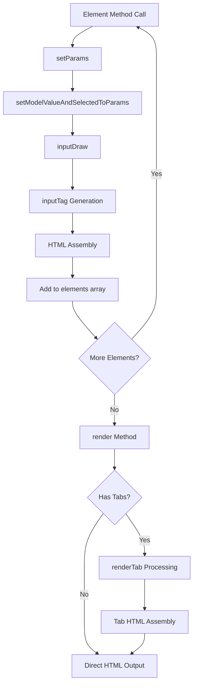

# Sistem Rendering & Templating

## 🎨 Overview

Sistem rendering CanvaStack Form menggunakan **multi-stage pipeline** untuk mengkonversi element definitions menjadi HTML output yang siap ditampilkan. Sistem ini menggabungkan Laravel Collective HTML, Bootstrap styling, dan custom templating logic.

## 🔄 Rendering Pipeline



## 📝 Rendering Stages

### Stage 1: Parameter Collection
```php
private function setParams($function_name, $name, $value, $attributes, $label, $selected = false)
```

**Process**:
1. **Label Generation**: Auto-generate dari field name jika `$label = true`
2. **Attribute Merging**: Combine dengan global attributes
3. **Validation Integration**: Apply validation attributes
4. **Model Binding**: Call `setModelValueAndSelectedToParams()`
5. **Storage**: Store dalam `$this->params[$function_name][$name]`

**Example Flow**:
```php
// Input
$form->text('first_name', null, ['required'], true);

// Parameter Processing
setParams('text', 'first_name', null, ['required'], true, false);

// Result
$this->params['text']['first_name'] = [
    'label' => 'First Name',
    'value' => null, // atau dari model binding
    'selected' => null,
    'attributes' => ['required' => true, 'class' => 'form-control']
];
```

### Stage 2: Model Value Binding
```php
private function setModelValueAndSelectedToParams($function_name, $name, $value, $selected)
```

**Logic Branches**:

**Text/Email/Number Fields**:
```php
if ('create' === $this->currentRouteName) {
    $value = $provided_value; // Use provided value
} else {
    $value = $this->getModelValue($name, $function_name); // Load from model
}
```

**Select Fields**:
```php
if ('create' === $this->currentRouteName) {
    $selected = $provided_selected;
} elseif ('edit' === $this->currentRouteName) {
    $selected = $provided_selected ?: $this->getModelValue($name, $function_name);
}
```

**Checkbox Fields** (Special Handling):
```php
$selected = $this->getModelValue($name, $function_name);
if (!is_array($selected)) {
    $selected = explode(',', $selected); // Convert "1,2,3" to [1,2,3]
    $select = [];
    foreach ($selected as $s) {
        $select[intval($s)] = intval($s); // Format for checkbox matching
    }
    $selected = $select;
}
```

### Stage 3: HTML Drawing
```php
private function inputDraw($function_name, $name)
```

**Process**:
1. **Field Exclusion Check**: Skip jika dalam `$this->excludeFields`
2. **Hide Field Check**: Apply hide class jika dalam `$this->hideFields`
3. **Required Symbol**: Add asterisk (*) untuk required fields
4. **Bootstrap Wrapper**: Apply Bootstrap form-group structure
5. **Label Generation**: Create label dengan styling
6. **Input Generation**: Call `inputTag()` untuk actual input

**Template Structure**:
```html
<div class="form-group row{hide_class}">
    <label class="col-sm-3 control-label">{label}{required_symbol}</label>
    <div class="input-group col-sm-9">
        {input_element}
    </div>
</div>
```

**Required Symbol Logic**:
```php
if (true === in_array('required', $attributes) || 
    true === in_array('required', array_keys($attributes))) {
    $req_symbol = ' <font class="required" title="This Required Field cannot be Leave Empty!"><sup>(</sup><strong>*</strong><sup>)</sup></font>';
}
```

### Stage 4: Input Tag Generation
```php
private function inputTag($function_name, $name, $attributes, $value)
```

**Element-Specific Rendering**:

**File Inputs**:
```php
if ('file' === $function_name) {
    return $this->inputFile($name, $attributes);
}
```

**Select Elements**:
```php
if ('select' === $function_name) {
    $selected = $this->params[$function_name][$name]['selected'];
    return '<div class="input-group col-sm-9">' . 
           Form::select($name, $value, $selected, $attributes) . 
           '</div>';
}
```

**Checkbox Elements**:
```php
if ('checkbox' === $function_name) {
    $selected = $this->params[$function_name][$name]['selected'];
    return '<div class="input-group col-sm-9">' . 
           $this->drawCheckBox($name, $value, $selected, $attributes) . 
           '</div>';
}
```

**Standard Text Inputs**:
```php
// DateTime elements converted to text with special classes
if ('date' === $function_name || 'datetime' === $function_name || 
    'daterange' === $function_name || 'time' === $function_name) {
    $function_name = 'text';
}

return '<div class="input-group col-sm-9">' . 
       Form::{$function_name}($name, $value, $attributes) . 
       '</div>';
```

## 🏗️ Template System

### Bootstrap Integration

**Form Group Structure**:
```html
<!-- Standard Layout -->
<div class="form-group row">
    <label class="col-sm-3 control-label">Label *</label>
    <div class="input-group col-sm-9">
        <input type="text" name="field" class="form-control" required>
    </div>
</div>
```

**CSS Classes Applied**:
- `form-group row`: Bootstrap form group dengan row layout
- `col-sm-3`: Label column width (3/12)
- `control-label`: Bootstrap label styling
- `input-group col-sm-9`: Input container (9/12)
- `form-control`: Bootstrap input styling

### Element-Specific Templates

#### File Upload Template
```html
<!-- Image Preview -->
<div class="fileinput fileinput-new" data-provides="fileinput">
    <div id="field-fileinput-preview" class="fileinput-preview thumbnail" 
         style="width: 198px; height: 150px;">
        
    </div>
    <div>
        <span class="btn btn-primary btn-file">
            <span class="fileinput-new">Select Image</span>
            <span class="fileinput-exists">Change</span>
            <input type="file" name="field">
        </span>
        <a href="#" class="btn btn-danger fileinput-exists" data-dismiss="fileinput">Remove</a>
    </div>
</div>

<!-- Regular File -->
<div class="fileinput fileinput-new input-group" data-provides="fileinput">
    <div class="form-control" data-trigger="fileinput">
        <i class="glyphicon glyphicon-file fileinput-exists"></i> 
        <span class="fileinput-filename">existing_file.pdf</span>
    </div>
    <span class="input-group-addon btn btn-primary btn-file">
        <span class="fileinput-new">Select File</span>
        <span class="fileinput-exists">Change</span>
        <input type="file" name="field">
    </span>
    <a href="#" class="input-group-addon btn btn-danger fileinput-exists" 
       data-dismiss="fileinput">Remove</a>
</div>
```

#### Checkbox Template
```html
<!-- Standard Checkboxes -->
<div class="col-sm-3 ckbox ckbox-primary">
    <input type="checkbox" name="field[value]" value="value" id="diyValue123">
    <label for="diyValue123">Option Label</label>
</div>

<!-- Switch Toggle -->
<div class="switch-box">
    <div class="s-swtich col-sm-5">
        <input type="checkbox" name="field[value]" value="value" class="switch" id="diyValue456">
        <label for="diyValue456">Toggle</label>
    </div>
    <label>Option Label</label>
</div>
```

#### Radio Template
```html
<div class="rdio rdio-primary circle">
    <input type="radio" name="field" value="value" id="diyValue789">
    <label for="diyValue789">Option Label</label>
</div>
```

### Tab System Template

**Complete Tab Structure**:
```html
<div class="tabbable">
    <ul class="nav nav-tabs" role="tablist">
        <li class="nav-item">
            <a class="nav-link active" data-toggle="tab" role="tab" href="#tab1">
                <i class="fa-icon"></i>Tab 1 Title
            </a>
        </li>
        <li class="nav-item">
            <a class="nav-link" data-toggle="tab" role="tab" href="#tab2">
                <i class="fa-icon"></i>Tab 2 Title
            </a>
        </li>
    </ul>
    <div class="tab-content">
        <div id="tab1" class="tab-pane fade in active" role="tabpanel">
            <!-- Tab 1 content -->
        </div>
        <div id="tab2" class="tab-pane fade" role="tabpanel">
            <!-- Tab 2 content -->
        </div>
    </div>
</div>
```

## 🔧 Rendering Methods

### Main Render Method
```php
public function render($object)
```

**Process**:
1. **Input Processing**: Convert array ke string jika perlu
2. **Tab Detection**: Check untuk tab markers `--[openTabHTMLForm]--`
3. **Route Decision**: Call `renderTab()` atau return raw HTML
4. **Output**: Return final HTML string atau array

**Example**:
```php
$form = new Objects();
$form->open();
$form->text('name');
$form->email('email');
$form->close('Submit');

// Render
$html = $form->render($form->elements);
echo $html; // Complete form HTML
```

### Label Rendering
```php
public function label($name, $value, $attributes = [])
```

**Features**:
- **Bootstrap Classes**: Automatic `col-sm-3 control-label`
- **HTML Decoding**: Using `Html::decode()`
- **Consistent Styling**: Standardized label appearance

### Advanced Rendering Features

#### Dynamic Class Application
```php
// Auto-applied classes berdasarkan element type
$attributes = canvastack_form_change_input_attribute($attributes, 'class', 'form-control');

// DateTime-specific classes
if ('date' === $function_name) {
    $attributes = canvastack_form_change_input_attribute($attributes, 'class', 'date-picker');
}
```

#### Validation Attribute Integration
```php
protected static function checkValidationAttributes($field_name, $current_attributes = [])
{
    if (!empty(self::$validation_attributes[$field_name])) {
        return array_unique(array_merge_recursive([self::$validation_attributes[$field_name]], $current_attributes));
    }
    return $current_attributes;
}
```

#### Hide Field Logic
```php
if (in_array($name, $this->hideFields)) {
    $hideClass = ' hide';
    $attributes = canvastack_form_change_input_attribute($attributes, 'class', trim($hideClass));
}
```

## 🎯 Output Examples

### Simple Form Output
```html
<form method="POST" action="/users" name="encrypted_form_name">
    <div class="form-container">
        <div class="form-group row">
            <label class="col-sm-3 control-label">Name <font class="required" title="This Required Field cannot be Leave Empty!"><sup>(</sup><strong>*</strong><sup>)</sup></font></label>
            <div class="input-group col-sm-9">
                <input type="text" name="name" class="form-control" required>
            </div>
        </div>
        <div class="form-group row">
            <label class="col-sm-3 control-label">Email <font class="required"><sup>(</sup><strong>*</strong><sup>)</sup></font></label>
            <div class="input-group col-sm-9">
                <input type="email" name="email" class="form-control" required>
            </div>
        </div>
        <div class="diy-action-box">
            <input type="submit" value="Submit" class="btn btn-success btn-slideright pull-right btn_create">
        </div>
    </div>
</form>
```

### Model-Bound Form Output
```html
<form method="POST" action="/users/1" name="encrypted_model_form">
    <input type="hidden" name="_method" value="PUT">
    <input type="hidden" name="_token" value="csrf_token_here">
    <div class="form-container">
        <div class="form-group row">
            <label class="col-sm-3 control-label">Name</label>
            <div class="input-group col-sm-9">
                <input type="text" name="name" value="John Doe" class="form-control">
            </div>
        </div>
        <!-- More fields populated dengan model data -->
    </div>
</form>
```

## ⚡ Performance Optimizations

### Efficient String Concatenation
```php
// Elements array untuk efficient assembly
$this->elements[] = $html_string; // Append only

// Final rendering
$html = implode('', $this->elements); // Single concatenation
```

### Lazy Evaluation
```php
// Parameters stored, HTML generated hanya saat dibutuhkan
$this->params[$function_name][$name] = $config;

// inputDraw() called hanya untuk visible fields
if (in_array($name, $this->excludeFields)) {
    return false; // Skip rendering
}
```

### Memory Management
```php
// Clean up setelah render
unset($this->params[$function_name][$name]);

// Reuse configuration objects
$default_attributes = ['class' => 'form-control'];
```

## 🔍 Debugging Rendering

### Element Inspection
```php
// Check stored elements
dd($form->elements);

// Check parameters
dd($form->params);

// Check individual element
dd($form->element_name);
```

### Rendering Steps
```php
// Debug parameter setting
public function setParams($function_name, $name, $value, $attributes, $label, $selected = false) {
    // Add debugging
    logger("Setting params for {$function_name}:{$name}", compact('value', 'attributes', 'label'));
    // ... rest of method
}
```

---

**Next**: [Validation & Error Handling](./VALIDATION.md)