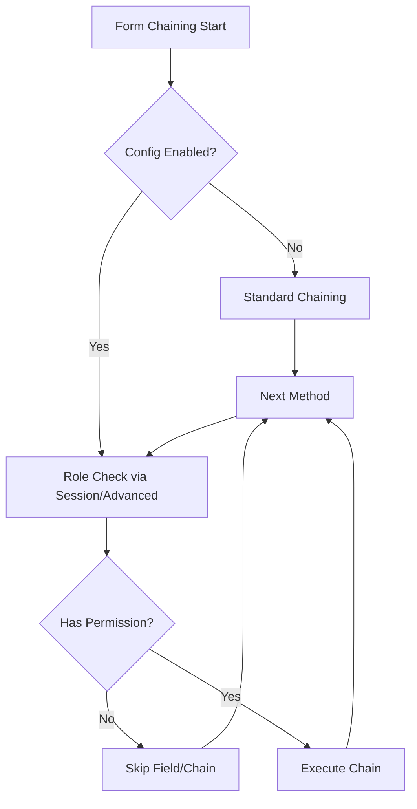

# Analisis Modularisasi Chaining Sistem Form dengan Role & User Access Management di CanvaStack

## Ringkasan
Ya, memungkinkan untuk memodularisasi chaining sistem form dengan role dan user access management di CanvaStack. Analisis ini berdasarkan kode existing: Form Objects.php menggunakan method chaining (setParams → inputDraw → render), role system via session privileges (Action.php: $this->session['user_group'], $this->session['roles']), module privileges (Modules.php: privileges method untuk index/admin access), config di canvastack.settings.php (role group format), dan advanced RBAC/ABAC di AdvancedAccessControlManager.php (modes seperti rbac/abac). Current chaining tidak integrated dengan role, tapi bisa di-modular via optional trait atau middleware untuk conditional chaining (e.g., $form->text()->whenHasRole('admin', fn() => $form->addAdminField())).

## Current Implementation
- **Form Chaining**: Objects.php punya chaining seperti $form->open()->text()->close()->render(). Setiap method (text, select, etc.) call setParams dan inputDraw, yang generate HTML tanpa role checks. Model binding di model() check session untuk auth, tapi no field-level role gating.
- **Role Access**: Action.php punya auth checks sebelum insert/update (auth()->check(), session['user_group']), Modules.php manage privileges (index_privilege, admin_privilege), config settings.php format role identity. AdvancedAccessControlManager.php support RBAC (role hierarchy), ABAC (department/time/location checks), dengan modes (disabled/basic/rbac/abac/hybrid/custom).
- **Integration Gap**: Form tidak check role untuk show/hide fields atau conditional chaining. Current: all fields rendered; role checks di controller level (pre/post action).

## Feasibility Modularisasi
Memungkinkan 100%. Proposal:
- **Optional Trait**: Buat RoleChainingTrait dengan methods seperti whenHasRole('admin', fn($form) => $form->addField()). Extend Objects.php jika config 'form.role_chaining.enabled' = true.
- **Config Flag**: Di config/canvastack.form.php: 'role_chaining' => ['enabled' => false, 'provider' => 'session' | 'advanced']. Jika disabled, chaining standard tanpa role checks.
- **Middleware**: FormMiddleware check session privileges sebelum render, hide fields via attributes (e.g., 'data-role-hidden' = true jika no access).
- **Backward Compatibility**: Non-chaining tetap work (default false). Use trait via use RoleChainingTrait; if in Objects.
- **Integration**: Leverage existing session['roles'] atau AdvancedAccessControlManager::hasPermission($user, $field, 'view'). For chaining, wrap methods dengan role check, skip jika no access (e.g., return $form untuk conditional).

## Contoh Kode Proposal
### Config (config/canvastack.form.php)
```php
'role_chaining' => [
    'enabled' => true,
    'provider' => 'session', // 'session' atau 'advanced'
    'default_role' => 'user',
],
```

### RoleChainingTrait
```php
trait RoleChainingTrait {
    protected function whenHasRole($role, $callback) {
        $userRoles = session('roles', []);
        if (in_array($role, $userRoles)) {
            return $callback($this);
        }
        return $this;
    }

    // Example usage in chaining
    public function textWithRole($name, $value, $attributes, $label) {
        return $this->whenHasRole('admin', function ($form) use ($name, $value, $attributes, $label) {
            return $form->text($name, $value, $attributes, $label);
        });
    }
}
```

### Usage
```php
$form = new Objects();
if (config('form.role_chaining.enabled')) {
    $form->use RoleChainingTrait;
}

$form->open()
     ->whenHasRole('admin', fn($f) => $f->text('admin_field', null, [], 'Admin Only'))
     ->text('public_field', null, [], 'Public Field')
     ->close();
```

## Diagram Alur


## Estimasi Effort
- **Development**: 4-6 jam (trait + config + integration di Objects.php).
- **Testing**: 2-3 jam (unit tests untuk conditional chaining, integration dengan role mocks).
- **Backward Compatibility**: 1 jam (config flag + docs update).
- **Total**: 7-10 jam. Low risk karena optional.

## Rekomendasi
- **Implementasi**: Tambah trait di Objects.php dengan config check. Use session['roles'] untuk simple, atau AdvancedAccessControlManager untuk advanced RBAC.
- **Benefits**: Flexible (optional), scalable (extend untuk ABAC), maintainable (decoupled dari core form).
- **Risiko**: Minimal; test chaining tanpa role tetap work.

Proposal ini memungkinkan chaining optional dengan role management, sesuai request.