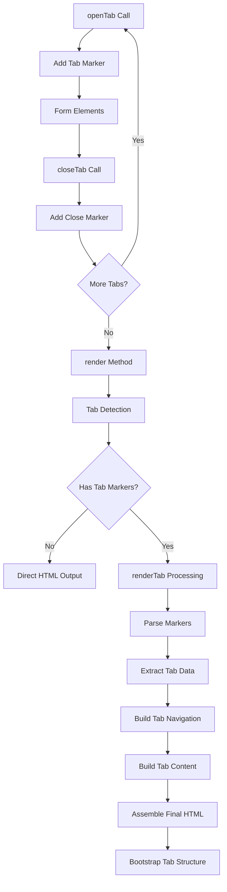

# Tab System & Rendering Logic

## 🎮 Overview

Tab System CanvaStack menyediakan cara elegant untuk mengorganisir form elements ke dalam tab-tab terpisah. Sistem ini menggunakan **marker-based parsing** dengan **placeholder substitution** untuk mengkonversi linear form elements menjadi dynamic tab interface dengan Bootstrap styling.

## 🏗️ Architecture



## 🏷️ Tab Markers & Placeholders

### Core Markers
```php
private $opentabHTML = '--[openTabHTMLForm]--';      // Tab system detector
private $openNewTab = '--[openNewTab]--';            // Individual tab separator
private $openNewTabClass = '--[openNewTabClass]--';  // Icon class separator  
private $closedtabHTML = '--[closeTabHTMLForm]--';   // Tab closure marker
```

### Marker Flow Example
```html
<!-- Raw form elements dengan markers -->
<form>--[openTabHTMLForm]--Personal Info--[openNewTabClass]--fa-user--[openNewTab]--
<div class="form-group">...</div>
<div class="form-group">...</div>
--[closeTabHTMLForm]--
--[openTabHTMLForm]--Settings--[openNewTabClass]--fa-cog--[openNewTab]--
<div class="form-group">...</div>
--[closeTabHTMLForm]--
</form>

<!-- After processing menjadi Bootstrap tabs -->
<form>
    <div class="tabbable">
        <ul class="nav nav-tabs">...</ul>
        <div class="tab-content">...</div>
    </div>
</form>
```

## 🎯 Core Methods

### Tab Creation Methods

#### `openTab($label, $class)`
```php
public function openTab($label, $class = false)
```

**Purpose**: Start new tab section dengan label dan optional icon  
**Parameters**:
- `$label`: Tab title/name
- `$class`: Optional CSS icon class (e.g., 'fa-user', 'fa-cog')

**Process**:
1. Build class attribute string jika ada icon
2. Combine markers dengan label dan class
3. Add ke elements array

**Internal Logic**:
```php
$classAttribute = false;
if ($class) {
    $classAttribute = "{$this->openNewTabClass}{$class}";
}

$this->draw("{$this->opentabHTML}{$label}{$classAttribute}{$this->openNewTab}");
```

**Generated Marker**:
```html
--[openTabHTMLForm]--Personal Info--[openNewTabClass]--fa-user--[openNewTab]--
```

#### `closeTab()`
```php
public function closeTab()
```

**Purpose**: Close current tab section  
**Process**: Add close marker ke elements array

```php
$this->draw("{$this->closedtabHTML}");
```

#### `addTabContent($content)`
```php
public function addTabContent($content)
```

**Purpose**: Add custom HTML content ke current tab  
**Usage**: Untuk content yang tidak bisa dibuat dengan standard form elements

```php
$form->openTab('Custom Content');
$form->addTabContent('<div class="alert alert-info">Custom HTML here</div>');
$form->text('field_name');
$form->closeTab();
```

### Tab Usage Patterns

#### Basic Tab Structure
```php
$form = new Objects();
$form->open();

// Tab 1
$form->openTab('Personal Information', 'fa-user');
$form->text('first_name', null, ['required'], 'First Name');
$form->text('last_name', null, ['required'], 'Last Name'); 
$form->email('email', null, ['required'], 'Email');
$form->closeTab();

// Tab 2  
$form->openTab('Contact Details', 'fa-phone');
$form->text('phone', null, [], 'Phone Number');
$form->textarea('address', null, [], 'Address');
$form->closeTab();

// Tab 3
$form->openTab('Settings', 'fa-cog');
$form->selectbox('timezone', $timezones, null, [], 'Timezone');
$form->checkbox('notifications', ['email' => 'Email', 'sms' => 'SMS'], [], [], 'Notifications');
$form->closeTab();

$form->close('Save Profile');
echo $form->render($form->elements);
```

#### Advanced Tab dengan Model Binding
```php
$form = new Objects();
$form->setValidations([
    'name' => 'required|string|max:255',
    'email' => 'required|email|unique:users,email,' . $user->id,
    'avatar' => 'nullable|image|max:2048'
]);

$form->modelWithFile($user, $user->id);

$form->openTab('Basic Info', 'fa-info-circle');
$form->text('name', null, ['required'], 'Full Name');
$form->email('email', null, ['required'], 'Email Address');
$form->date('birth_date', null, [], 'Birth Date');
$form->closeTab();

$form->openTab('Profile', 'fa-camera');  
$form->file('avatar', ['imagepreview'], 'Profile Picture');
$form->textarea('bio', null, [], 'Biography');
$form->closeTab();

$form->openTab('Preferences', 'fa-sliders');
$form->selectbox('language', $languages, null, [], 'Language');
$form->radiobox('theme', ['light' => 'Light', 'dark' => 'Dark'], 'light', [], 'Theme');
$form->closeTab();

$form->close('Update Profile');
echo $form->render($form->elements);
```

## 🔧 Tab Rendering Process

### Main Rendering Method

#### `renderTab($object)`
```php
public function renderTab($object)
```

**Purpose**: Convert marker-based content menjadi Bootstrap tab structure  
**Process**: Multi-stage parsing dan HTML generation

**Stage 1: Input Processing**
```php
if (true === is_array($object)) {
    $object = implode('', $object);
}
```

**Stage 2: Content Splitting**
```php
// Split berdasarkan close markers
$closeTab = explode($this->closedtabHTML, $object);

// Separate content after tabs
$dataAfterTab = $closeTab[count($closeTab) - 1];
unset($closeTab[count($closeTab) - 1]);
```

**Stage 3: Tab Extraction**
```php
$openTabs = [];
foreach ($closeTab as $index => $newTab) {
    $openTab = explode($this->opentabHTML, $newTab);
    
    // Preserve form opening tag
    if (true === canvastack_string_contained($openTab[$index], '<form method=')) {
        $dataBeforeTab = $openTab[$index];
        unset($openTab[$index]);
    }
    
    $openTabs[] = $openTab;
}
```

**Stage 4: Tab Structure Building**
```php
$tabContainer = [];
$tabHeaders = [];  
$tabContents = [];

foreach ($openTabs as $list => $tabs) {
    $tabContainer[$list][] = '<div class="tabbable">';
    $tabHeaders[$list][] = '<ul class="nav nav-tabs" role="tablist">';
    $tabContents[$list][] = '<div class="tab-content">';
    
    // Process individual tabs...
}
```

### Tab Processing Logic

#### Individual Tab Parsing
```php
foreach ($tabs as $index => $tab) {
    if (isset($tab) && !empty($tab)) {
        $sliceTabs = explode($this->openNewTab, $tab);
    }
    
    if (true === canvastack_string_contained($tab, $this->openNewTab)) {
        // Set active state untuk first tab
        $activeHeader = false;
        $activeContent = false;
        if (1 === $index) {
            $activeHeader = 'active';
            $activeContent = 'in active';
        }
        
        // Parse label dan icon
        $label = trim($sliceTabs[0]);
        $labelClass = false;
        if (canvastack_string_contained($sliceTabs[0], $this->openNewTabClass)) {
            $sliceLabel = explode($this->openNewTabClass, $label);
            $label = trim($sliceLabel[0]);
            $labelClass = trim($sliceLabel[1]);
        }
        
        // Generate tab header dan content
        $tabHeaders[$list][] = canvastack_form_create_header_tab(
            $label, 
            strtolower(canvastack_clean_strings($label)), 
            $activeHeader, 
            $labelClass
        );
        
        $tabContents[$list][] = canvastack_form_create_content_tab(
            trim($sliceTabs[1]), 
            strtolower(canvastack_clean_strings($label)), 
            $activeContent
        );
    }
}
```

#### Helper Functions Integration

**Header Tab Creation**:
```php
canvastack_form_create_header_tab($data, $pointer, $active = false, $class = false)
```

Generated HTML:
```html
<li class="nav-item">
    <a class="nav-link active" data-toggle="tab" role="tab" href="#personalinformation">
        <i class="fa-user"></i>Personal Information
    </a>
</li>
```

**Content Tab Creation**:
```php
canvastack_form_create_content_tab($data, $pointer, $active = false)
```

Generated HTML:
```html
<div id="personalinformation" class="tab-pane fade in active" role="tabpanel">
    <!-- Tab content here -->
    <div class="form-group row">...</div>
    <div class="form-group row">...</div>
</div>
```

## 📋 Complete Tab HTML Structure

### Final Output Template
```html
<form method="POST" action="/users/1">
    <div class="tabbable">
        <!-- Navigation Headers -->
        <ul class="nav nav-tabs" role="tablist">
            <li class="nav-item">
                <a class="nav-link active" data-toggle="tab" role="tab" href="#personalinformation">
                    <i class="fa-user"></i>Personal Information
                </a>
            </li>
            <li class="nav-item">
                <a class="nav-link" data-toggle="tab" role="tab" href="#contactdetails">
                    <i class="fa-phone"></i>Contact Details
                </a>
            </li>
            <li class="nav-item">
                <a class="nav-link" data-toggle="tab" role="tab" href="#settings">
                    <i class="fa-cog"></i>Settings
                </a>
            </li>
        </ul>
        
        <!-- Tab Content Panels -->
        <div class="tab-content">
            <div id="personalinformation" class="tab-pane fade in active" role="tabpanel">
                <div class="form-group row">
                    <label class="col-sm-3 control-label">First Name *</label>
                    <div class="input-group col-sm-9">
                        <input type="text" name="first_name" class="form-control" required>
                    </div>
                </div>
                <div class="form-group row">
                    <label class="col-sm-3 control-label">Last Name *</label>
                    <div class="input-group col-sm-9">
                        <input type="text" name="last_name" class="form-control" required>
                    </div>
                </div>
            </div>
            
            <div id="contactdetails" class="tab-pane fade" role="tabpanel">
                <div class="form-group row">
                    <label class="col-sm-3 control-label">Phone Number</label>
                    <div class="input-group col-sm-9">
                        <input type="text" name="phone" class="form-control">
                    </div>
                </div>
            </div>
            
            <div id="settings" class="tab-pane fade" role="tabpanel">
                <div class="form-group row">
                    <label class="col-sm-3 control-label">Timezone</label>
                    <div class="input-group col-sm-9">
                        <select name="timezone" class="form-control chosen-select-deselect">
                            <option value="">Select Timezone</option>
                            <!-- Options -->
                        </select>
                    </div>
                </div>
            </div>
        </div>
    </div>
    
    <!-- Form Actions -->
    <div class="diy-action-box">
        <input type="submit" value="Save Profile" class="btn btn-success">
    </div>
</form>
```

## 🎨 Bootstrap Integration

### Required CSS Classes
```css
/* Tab Navigation */
.nav-tabs {
    border-bottom: 1px solid #ddd;
    margin-bottom: 20px;
}

.nav-item {
    margin-bottom: -1px;
}

.nav-link {
    display: block;
    padding: 10px 15px;
    border: 1px solid transparent;
    border-radius: 4px 4px 0 0;
}

.nav-link.active {
    color: #555;
    background-color: #fff;
    border: 1px solid #ddd;
    border-bottom-color: transparent;
}

/* Tab Content */
.tab-content {
    padding: 20px 0;
}

.tab-pane {
    display: none;
}

.tab-pane.active {
    display: block;
}

.tab-pane.fade {
    opacity: 0;
    transition: opacity 0.15s linear;
}

.tab-pane.fade.in {
    opacity: 1;
}
```

### Required JavaScript
```javascript
// Bootstrap Tab Functionality
$(document).ready(function() {
    // Tab switching
    $('.nav-tabs a').click(function(e) {
        e.preventDefault();
        
        // Remove active classes
        $('.nav-link').removeClass('active');
        $('.tab-pane').removeClass('active in');
        
        // Add active class ke clicked tab
        $(this).addClass('active');
        
        // Show target content
        var target = $(this).attr('href');
        $(target).addClass('active in');
    });
    
    // Form validation per tab
    $('form').on('submit', function(e) {
        var hasErrors = false;
        var firstErrorTab = null;
        
        // Check each tab untuk required fields
        $('.tab-pane').each(function() {
            var tabId = $(this).attr('id');
            var requiredFields = $(this).find('[required]');
            
            requiredFields.each(function() {
                if ($(this).val().trim() === '') {
                    hasErrors = true;
                    if (!firstErrorTab) {
                        firstErrorTab = tabId;
                    }
                    $(this).addClass('is-invalid');
                }
            });
        });
        
        if (hasErrors) {
            e.preventDefault();
            
            // Switch ke tab dengan error pertama
            if (firstErrorTab) {
                $('.nav-tabs a[href="#' + firstErrorTab + '"]').click();
            }
            
            alert('Please fill all required fields.');
            return false;
        }
    });
});
```

## 🔍 Advanced Tab Features

### Dynamic Tab Addition
```php
class DynamicTabForm extends Objects 
{
    protected $dynamicTabs = [];
    
    public function addDynamicTab($id, $label, $icon, $fields)
    {
        $this->dynamicTabs[$id] = [
            'label' => $label,
            'icon' => $icon,  
            'fields' => $fields
        ];
    }
    
    public function renderDynamicTabs()
    {
        foreach ($this->dynamicTabs as $id => $tab) {
            $this->openTab($tab['label'], $tab['icon']);
            
            foreach ($tab['fields'] as $field) {
                $method = $field['type'];
                $this->$method(
                    $field['name'],
                    $field['value'] ?? null,
                    $field['attributes'] ?? [],
                    $field['label'] ?? true
                );
            }
            
            $this->closeTab();
        }
    }
}

// Usage
$form = new DynamicTabForm();
$form->model($user);

$form->addDynamicTab('personal', 'Personal Info', 'fa-user', [
    ['type' => 'text', 'name' => 'first_name', 'attributes' => ['required']],
    ['type' => 'text', 'name' => 'last_name', 'attributes' => ['required']],
    ['type' => 'email', 'name' => 'email', 'attributes' => ['required']]
]);

$form->addDynamicTab('contact', 'Contact', 'fa-phone', [
    ['type' => 'text', 'name' => 'phone'],
    ['type' => 'textarea', 'name' => 'address']
]);

$form->renderDynamicTabs();
$form->close('Save');
```

### Conditional Tab Display
```php
public function buildConditionalTabs($user, $permissions)
{
    $form = new Objects();
    $form->model($user, $user->id);
    
    // Basic info - always visible
    $form->openTab('Basic Information', 'fa-info');
    $form->text('name', null, ['required'], 'Name');
    $form->email('email', null, ['required'], 'Email');
    $form->closeTab();
    
    // Admin settings - hanya untuk admin
    if ($permissions->can('admin.settings')) {
        $form->openTab('Admin Settings', 'fa-shield');
        $form->selectbox('role', $roles, null, [], 'Role');
        $form->checkbox('permissions', $allPermissions, [], [], 'Permissions');
        $form->closeTab();
    }
    
    // Profile settings - untuk semua user
    $form->openTab('Profile', 'fa-user');
    $form->file('avatar', ['imagepreview'], 'Avatar');
    $form->textarea('bio', null, [], 'Biography');
    $form->closeTab();
    
    return $form;
}
```

### Tab dengan Ajax Loading
```javascript
// Tab content lazy loading
$('.nav-tabs a[data-ajax]').on('shown.bs.tab', function(e) {
    var target = $(e.target).attr('href');
    var url = $(e.target).data('ajax');
    
    if (!$(target).data('loaded')) {
        $(target).html('<div class="text-center"><i class="fa fa-spinner fa-spin"></i> Loading...</div>');
        
        $.get(url, function(data) {
            $(target).html(data).data('loaded', true);
        });
    }
});
```

## 🐛 Debugging Tab System

### Tab Markers Inspection
```php
// Check raw elements dengan markers
public function debugTabMarkers()
{
    $content = implode('', $this->elements);
    
    echo "Raw content:\n";
    echo htmlspecialchars($content);
    
    echo "\n\nMarkers found:\n";
    echo "Open tab markers: " . substr_count($content, $this->opentabHTML) . "\n";
    echo "Close tab markers: " . substr_count($content, $this->closedtabHTML) . "\n";
    echo "New tab markers: " . substr_count($content, $this->openNewTab) . "\n";
}

// Usage
$form->debugTabMarkers();
```

### Parsing Process Debug
```php
public function debugTabParsing($object)
{
    echo "=== TAB PARSING DEBUG ===\n";
    
    // Step 1: Close tab splitting
    $closeTab = explode($this->closedtabHTML, $object);
    echo "Split by close markers: " . count($closeTab) . " parts\n";
    
    // Step 2: Open tab splitting
    foreach ($closeTab as $index => $newTab) {
        $openTab = explode($this->opentabHTML, $newTab);
        echo "Part $index: " . count($openTab) . " segments\n";
        
        foreach ($openTab as $segIndex => $segment) {
            if (canvastack_string_contained($segment, $this->openNewTab)) {
                $sliceTabs = explode($this->openNewTab, $segment);
                $label = trim($sliceTabs[0]);
                
                echo "  Tab found: '$label'\n";
            }
        }
    }
}
```

## ⚡ Performance Considerations

### Marker Processing Optimization
```php
// Cache parsed tab structure
private static $tabCache = [];

public function renderTabWithCache($object)
{
    $cacheKey = md5($object);
    
    if (isset(self::$tabCache[$cacheKey])) {
        return self::$tabCache[$cacheKey];
    }
    
    $result = $this->renderTab($object);
    self::$tabCache[$cacheKey] = $result;
    
    return $result;
}
```

### Large Form Optimization
```php
// Limit tab content processing
public function renderTabsSelectively($object, $activeTabOnly = false)
{
    if (!$activeTabOnly) {
        return $this->renderTab($object);
    }
    
    // Render hanya active tab, lazy load others
    return $this->renderActiveTabOnly($object);
}
```

---

**Next**: [Helper Functions & Utilities](./HELPERS.md)