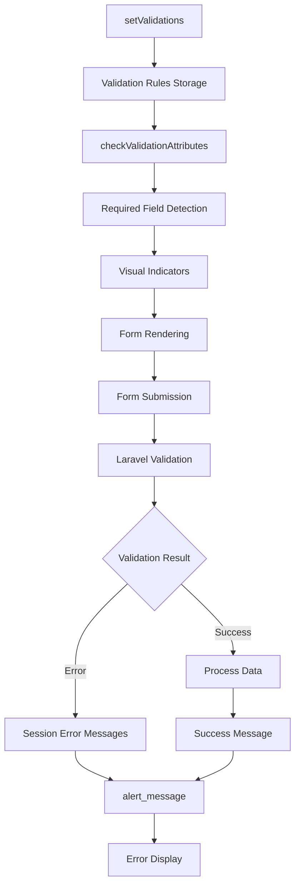

# Validasi & Error Handling

## 🛡️ Overview

Form System CanvaStack mengintegrasikan Laravel validation secara native dengan visual indicators dan error handling yang komprehensif. Sistem ini menyediakan server-side validation, client-side indicators, dan user-friendly error messages.

## 🔧 Validation Architecture



## 📝 Validation Methods

### Setting Validation Rules

#### `setValidations($data)`
```php
public function setValidations($data = [])
```

**Purpose**: Mengatur validation rules untuk form fields  
**Parameter**: Array dengan format `['field_name' => 'validation_rules']`

**Example**:
```php
$form = new Objects();
$form->setValidations([
    'name' => 'required|string|max:255',
    'email' => 'required|email|unique:users,email',
    'password' => 'required|min:8|confirmed',
    'age' => 'required|integer|min:18|max:120',
    'avatar' => 'nullable|image|max:2048',
    'terms' => 'required|accepted'
]);

$form->model(User::class);
$form->text('name', null, ['required'], true);
$form->email('email', null, ['required'], true);
$form->password('password', ['required'], true);
$form->close('Register');
```

**Internal Storage**:
```php
$this->validations = [
    'name' => 'required|string|max:255',
    'email' => 'required|email|unique:users,email',
    'password' => 'required|min:8|confirmed'
];
```

### Validation Attribute Processing

#### `checkValidationAttributes($field_name, $current_attributes)`
```php
protected static function checkValidationAttributes($field_name, $current_attributes = [])
```

**Purpose**: Menambahkan validation attributes ke form elements  
**Process**:
1. Check untuk `required` rule dalam validation
2. Merge dengan existing attributes
3. Apply ke HTML attributes

**Internal Logic**:
```php
// Detect required fields dari validation rules
$checkRequired = canvastack_array_contained_string($this->validations, 'required', true);
if (!empty($checkRequired)) {
    self::$validation_attributes = $checkRequired;
}

// Example result
self::$validation_attributes = [
    'name' => ['required' => true],
    'email' => ['required' => true],
    'password' => ['required' => true]
];
```

### Visual Indicators

#### Required Field Symbol
```php
if (true === in_array('required', $attributes) || true === in_array('required', array_keys($attributes))) {
    $req_symbol = ' <font class="required" title="This Required Field cannot be Leave Empty!"><sup>(</sup><strong>*</strong><sup>)</sup></font>';
}
```

**Generated HTML**:
```html
<label class="col-sm-3 control-label">
    Email Address 
    <font class="required" title="This Required Field cannot be Leave Empty!">
        <sup>(</sup><strong>*</strong><sup>)</sup>
    </font>
</label>
```

**CSS Styling** (recommended):
```css
.required {
    color: #d9534f;
    font-weight: bold;
}
```

## 🚨 Error Handling

### Session Message Processing

#### `alert_message($data)`
```php
private function alert_message($data = [])
```

**Purpose**: Menampilkan validation errors dan success messages  
**Features**:
- Session message processing
- Validation error display
- Success message formatting
- Bootstrap alert integration

**Message Flow**:
```php
// Controller
public function store(Request $request)
{
    $request->validate([
        'name' => 'required|string|max:255',
        'email' => 'required|email|unique:users'
    ]);
    
    // Success
    return redirect()->back()->with([
        'message' => 'User created successfully!',
        'status' => 'success'
    ]);
}

// Error (automatic by Laravel)
// Redirect back dengan validation errors dalam session
```

**Alert Message Generation**:
```php
// Default success message
$status = [
    'message' => 'Success',
    'type' => 'success',
    'prefix' => 'fa-exclamation-triangle'
];

// Override dengan session data
if (!empty($session_messages['message'])) {
    $status['message'] = $session_messages['message'];
}

if (!empty($session_status) && 'failed' === $session_status) {
    $status['type'] = 'warning';
}
```

### Error Display Templates

#### Success Message
```html
<div class="alert alert-block alert-success animated fadeInDown alert-dismissable" role="alert">
    <button type="button" class="close" data-dismiss="alert">
        <i class="fa fa-times"></i>
    </button>
    <p>
        <strong><i class="fa fa-check"></i> &nbsp;Success</strong> 
        User created successfully!
    </p>
</div>
```

#### Validation Error Message
```html
<div class="alert alert-block alert-warning animated fadeInDown alert-dismissable" role="alert">
    <button type="button" class="close" data-dismiss="alert">
        <i class="fa fa-times"></i>
    </button>
    <p><strong><i class="fa fa-exclamation-triangle"></i> &nbsp;Warning</strong></p>
    <ul class="alert-info-content">
        <li class="title">
            <div>
                <label class="control-label">Email</label>
                <ul class="content">
                    <li><label class="control-label">The email field is required.</label></li>
                </ul>
            </div>
        </li>
        <li class="title">
            <div>
                <label class="control-label">Name</label>
                <ul class="content">
                    <li><label class="control-label">The name field is required.</label></li>
                    <li><label class="control-label">The name may not be greater than 255 characters.</label></li>
                </ul>
            </div>
        </li>
    </ul>
</div>
```

## 📋 Validation Examples

### Basic Form Validation
```php
$form = new Objects();

// Set validation rules
$form->setValidations([
    'first_name' => 'required|string|max:100',
    'last_name' => 'required|string|max:100',
    'email' => 'required|email|unique:users,email',
    'phone' => 'required|regex:/^[0-9+\-\s]+$/',
    'birthdate' => 'required|date|before:today'
]);

// Create form
$form->model(User::class);
$form->text('first_name', null, ['required'], 'First Name');
$form->text('last_name', null, ['required'], 'Last Name');
$form->email('email', null, ['required'], 'Email Address');
$form->text('phone', null, ['required'], 'Phone Number');
$form->date('birthdate', null, ['required'], 'Birth Date');
$form->close('Create User');

echo $form->render($form->elements);
```

### File Upload Validation
```php
// Set file validation
$form->setValidations([
    'avatar' => 'required|image|mimes:jpeg,png,jpg|max:2048',
    'resume' => 'nullable|file|mimes:pdf,doc,docx|max:5120'
]);

// File elements dengan validation
$form->modelWithFile($user);
$form->file('avatar', ['imagepreview'], 'Profile Picture');
$form->file('resume', [], 'Resume (Optional)');
$form->close('Update Profile');

// Custom file validation dalam File trait
$fileInfo = [
    'avatar' => [
        'file_validation' => 'required|image|max:2048'
    ],
    'resume' => [
        'file_validation' => 'nullable|mimes:pdf,doc,docx|max:5120'
    ]
];

// Process upload dengan validation
$form->fileUpload('users', $request, $fileInfo);
```

### Complex Form Validation
```php
$form = new Objects();

// Multi-level validation rules
$form->setValidations([
    // Personal Info
    'name' => 'required|string|min:2|max:255',
    'email' => 'required|email|unique:users,email,' . ($user->id ?? ''),
    'phone' => 'required|regex:/^(\+62|62|0)[0-9]{9,13}$/',
    
    // Address
    'address' => 'required|string|max:500',
    'city' => 'required|string|max:100',
    'province' => 'required|string|max:100',
    'postal_code' => 'required|regex:/^[0-9]{5}$/',
    
    // Account Settings
    'password' => 'nullable|min:8|confirmed',
    'role' => 'required|in:admin,user,moderator',
    'is_active' => 'boolean',
    
    // Permissions (array validation)
    'permissions' => 'array',
    'permissions.*' => 'exists:permissions,id',
    
    // File uploads
    'avatar' => 'nullable|image|max:2048',
    'documents.*' => 'file|mimes:pdf,doc,docx|max:5120'
]);

// Tab form dengan validation
$form->model($user, $user->id ?? null);

$form->openTab('Personal Info');
$form->text('name', null, ['required'], 'Full Name');
$form->email('email', null, ['required'], 'Email Address');
$form->text('phone', null, ['required'], 'Phone Number');
$form->closeTab();

$form->openTab('Address');
$form->textarea('address', null, ['required'], 'Street Address');
$form->text('city', null, ['required'], 'City');
$form->selectbox('province', $provinces, null, ['required'], 'Province');
$form->text('postal_code', null, ['required'], 'Postal Code');
$form->closeTab();

$form->openTab('Account');
$form->password('password', [], 'New Password');
$form->password('password_confirmation', [], 'Confirm Password');
$form->selectbox('role', $roles, null, ['required'], 'Role');
$form->checkbox('is_active', [1 => 'Active Account'], null, [], 'Status');
$form->closeTab();

$form->close('Save Changes');
echo $form->render($form->elements);
```

## 🎯 Advanced Validation Features

### Custom Validation Messages
```php
// Controller
public function store(Request $request)
{
    $request->validate([
        'name' => 'required|string|max:255',
        'email' => 'required|email|unique:users'
    ], [
        'name.required' => 'Nama wajib diisi.',
        'name.max' => 'Nama tidak boleh lebih dari :max karakter.',
        'email.required' => 'Email wajib diisi.',
        'email.email' => 'Format email tidak valid.',
        'email.unique' => 'Email sudah terdaftar.'
    ]);
}
```

### Conditional Validation
```php
// Dynamic validation rules
$rules = [
    'name' => 'required|string|max:255',
    'email' => 'required|email'
];

// Add unique rule hanya untuk create mode
if ($this->currentRouteName === 'create') {
    $rules['email'] .= '|unique:users,email';
} else {
    $rules['email'] .= '|unique:users,email,' . $user->id;
}

// Add password rules hanya jika diisi
if ($request->filled('password')) {
    $rules['password'] = 'min:8|confirmed';
}

$form->setValidations($rules);
```

### Ajax Validation
```php
// Frontend JavaScript
$('#form').on('blur', 'input[name="email"]', function() {
    var email = $(this).val();
    
    $.ajax({
        url: '/validate-email',
        method: 'POST',
        data: { email: email },
        success: function(response) {
            if (response.exists) {
                $('#email-error').text('Email already exists');
                $('#email-input').addClass('is-invalid');
            } else {
                $('#email-error').text('');
                $('#email-input').removeClass('is-invalid');
            }
        }
    });
});

// Backend validation endpoint
public function validateEmail(Request $request)
{
    $exists = User::where('email', $request->email)->exists();
    return response()->json(['exists' => $exists]);
}
```

## 🔍 Error Debugging

### Validation State Inspection
```php
// Check validation rules
dd($form->validations);

// Check validation attributes applied
dd($form::$validation_attributes);

// Check session errors
dd(session('errors'));

// Check specific field errors
dd($errors->get('email'));
```

### Custom Error Display
```php
// Custom error handling dalam controller
public function store(Request $request)
{
    try {
        $validator = Validator::make($request->all(), [
            'email' => 'required|email|unique:users'
        ]);

        if ($validator->fails()) {
            return redirect()->back()
                ->withErrors($validator)
                ->withInput()
                ->with([
                    'message' => 'Please fix the errors below.',
                    'status' => 'failed'
                ]);
        }

        // Process successful validation
        
    } catch (Exception $e) {
        return redirect()->back()->with([
            'message' => 'An error occurred: ' . $e->getMessage(),
            'status' => 'failed'
        ]);
    }
}
```

## 📱 Client-Side Integration

### Bootstrap Validation Classes
```css
/* Visual feedback untuk validation */
.is-invalid {
    border-color: #dc3545;
    box-shadow: 0 0 0 0.2rem rgba(220, 53, 69, 0.25);
}

.is-valid {
    border-color: #28a745;
    box-shadow: 0 0 0 0.2rem rgba(40, 167, 69, 0.25);
}

.invalid-feedback {
    display: block;
    width: 100%;
    margin-top: 0.25rem;
    font-size: 0.875em;
    color: #dc3545;
}
```

### JavaScript Enhancement
```javascript
// Real-time validation feedback
$(document).ready(function() {
    // Add validation classes based pada required attributes
    $('input[required], select[required], textarea[required]').on('blur', function() {
        if ($(this).val().trim() === '') {
            $(this).addClass('is-invalid');
        } else {
            $(this).removeClass('is-invalid').addClass('is-valid');
        }
    });

    // Form submission validation
    $('form').on('submit', function(e) {
        var hasErrors = false;
        
        $(this).find('[required]').each(function() {
            if ($(this).val().trim() === '') {
                $(this).addClass('is-invalid');
                hasErrors = true;
            }
        });

        if (hasErrors) {
            e.preventDefault();
            alert('Please fill all required fields.');
            return false;
        }
    });
});
```

## 🛠️ Best Practices

### Validation Rules Organization
```php
// Gunakan form request classes untuk complex validation
class UserStoreRequest extends FormRequest
{
    public function rules()
    {
        return [
            'name' => 'required|string|max:255',
            'email' => 'required|email|unique:users,email',
            'password' => 'required|min:8|confirmed'
        ];
    }
    
    public function messages()
    {
        return [
            'name.required' => 'Name is required',
            'email.unique' => 'Email already exists'
        ];
    }
}

// Gunakan dalam form
$form->setValidations(app(UserStoreRequest::class)->rules());
```

### Error Message Customization
```php
// Helper untuk consistent error messages
class ValidationHelper
{
    public static function getCommonRules()
    {
        return [
            'name' => 'required|string|max:255',
            'email' => 'required|email',
            'phone' => 'required|regex:/^[0-9+\-\s]+$/',
            'password' => 'required|min:8'
        ];
    }
    
    public static function getCommonMessages()
    {
        return [
            'required' => ':attribute wajib diisi.',
            'email' => 'Format :attribute tidak valid.',
            'min' => ':attribute minimal :min karakter.',
            'max' => ':attribute maksimal :max karakter.'
        ];
    }
}
```

---

**Next**: [File Upload System](./FILE_UPLOAD.md)