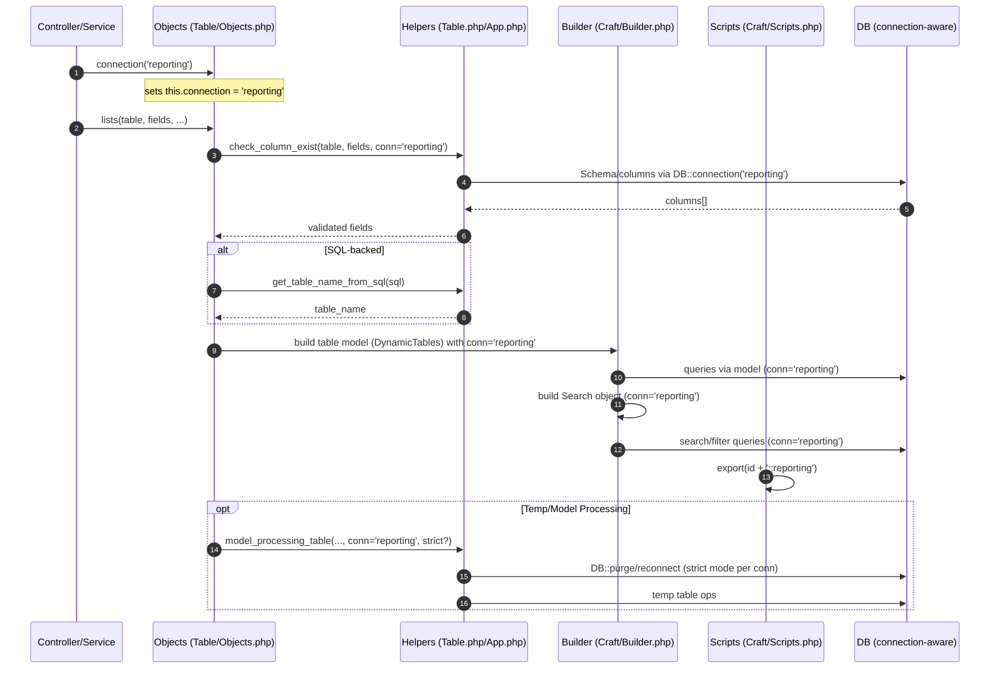
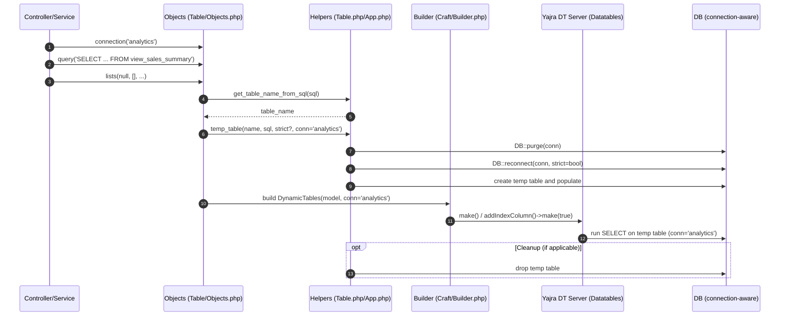

# Legacy Datatables Architecture: Connection Flow

This document explains how a database connection propagates through the legacy Datatables stack (Helpers ➜ Objects ➜ Builder ➜ Scripts) and where it is consumed. Use this as a reference when adding new features or refactoring.

## Overview

- A connection can be set on the Table Objects layer via `$this->table->connection('connection_name')`.
- That value is used consistently to:
  - Validate table schema and read column lists
  - Build a default model for dynamic tables
  - Power search/filter builders
  - Suffix export contexts
  - Process temporary/model-generated tables with optional strict mode
- If connection is not provided, code falls back to `config('database.default', 'mysql')`.
- Pipeline resolver includes dynamic connection autodetection: when a table/view is missing on the initial connection, it probes all configured connections and selects the first that can read the table (Phase 3+). This avoids hard-coded mappings and honors model-defined connections first.

## Key Components

- Objects (entry/coordination):
  - File: `packages/canvastack/canvastack/src/Library/Components/Table/Objects.php`
- Builder (HTML + JS data model):
  - File: `packages/canvastack/canvastack/src/Library/Components/Table/Craft/Builder.php`
- Scripts (JS for DataTables init):
  - File: `packages/canvastack/canvastack/src/Library/Components/Table/Craft/Scripts.php`
- Helper functions (DB utilities):
  - File: `packages/canvastack/canvastack/src/Library/Helpers/Table.php`
  - File: `packages/canvastack/canvastack/src/Library/Helpers/App.php`

## Connection Lifecycle (End-to-End)

1) Set connection in controller/service (Objects layer)

```php
// Controller or service
$this->table->connection('reporting');      // 1) Set connection
$this->table->lists('users', ['id','name']); // 2) Build table
```

- Setter:
  - Objects::connection($db_connection)
    - Path: `.../Components/Table/Objects.php`
    - Lines: ~1094–1096
    - Effect: sets `$this->connection` on the Table object.

2) Objects::config() (internal)

- Path: `.../Components/Table/Objects.php`
- Lines: ~1084–1092
- If `$this->connection` already set, re-applies via `$this->connection($this->connection)`.

3) Schema validation and column listing (Helpers)

- Lists flow (Objects::lists):
  - Path: `.../Components/Table/Objects.php`
  - Lines: ~1146+ (method start)
  - Calls to helpers, always passing the current connection when available:
    - Check columns exist:
      ```php
      $fields = $this->check_column_exist($table_name, $fields, $this->connection);
      // Objects.php ~1189
      ```
    - Get all columns (fallbacks):
      ```php
      $fields = canvastack_get_table_columns($table_name, $this->connection);
      // Objects.php ~1204
      ```
- Helper APIs (connection-aware):
  - `canvastack_check_table_columns($table_name, $field, $db_connection = null)`
    - Path: `.../Helpers/Table.php`
    - Lines: ~111–117, uses `DB::connection($db_connection)` schema builder
  - `canvastack_get_table_columns($table_name, $db_connection = null)`
    - Path: `.../Helpers/Table.php`
    - Lines: ~129–135, uses `DB::connection($db_connection)` schema builder
  - Defaults: when `$db_connection === null`, fallback to `config('database.default', 'mysql')`.

4) Optional model processing (Objects::runModel)

- Path: `.../Components/Table/Objects.php`
- Lines: ~212–227
- Establishes `$connection = $this->connection ?? 'mysql'` and stores it in `$this->variables['model_processing']`.
- Downstream, `canvastack_model_processing_table(...)` uses the stored connection and can toggle strict mode:
  - Path: `.../Helpers/Table.php`
  - Lines: ~202–214 (calls `canvastack_db('purge', $conn)` etc.)

5) Builder: default model construction

- Path: `.../Components/Table/Craft/Builder.php`
- Lines: ~40–44
- If no explicit model is provided, builder creates a dynamic model bound to the same connection:
  ```php
  $model = new DynamicTables(null, $this->connection);
  $model->setTable($name);
  ```
- This ensures server-side queries and filters use the intended connection.

6) Builder: Search/Filter object

- Path: `.../Components/Table/Craft/Builder.php`
- Lines: ~603–606
- Search object is created with connection propagated:
  ```php
  $search_object = new Search("{$searchInfo['id']}_cdyFILTER", $data_model, $search_data, $data_sql, $this->connection, $filterQuery);
  ```

7) Scripts: Export context uses connection suffix

- Path: `.../Components/Table/Craft/Scripts.php`
- Lines: ~133–138
- When connection is present, export ID is suffixed with `::{$this->connection}` for routing/export context:
  ```php
  $connection = null;
  if (!empty($this->connection)) {
      $connection = "::{$this->connection}";
  }
  $filter_js .= $this->export($attr_id . $connection, $exportURI);
  ```

8) Temp table creation and SQL querying (Helpers)

- Temp tables respect connection and strict mode:
  - Path: `.../Helpers/Table.php`
  - `canvastack_temp_table($table_name, $sql, $strict = true, $conn = 'mysql')` lines ~167–190
  - Purges/reconnects `DB` with updated strict mode for specified `$conn`.
- Raw query helper with optional connection:
  - Path: `.../Helpers/App.php`
  - `canvastack_query($sql, $type = 'TABLE', $connection = null)` lines ~269–276

## Control Points and Defaults

- Setter API:
  - `Objects::connection($name)` sets `$this->connection`.
  - `Objects::resetConnection()` resets to `null` (default connection applies).
- Default resolution order:
  1. Explicit `$this->connection`
  2. Helper default: `config('database.default', 'mysql')`
- Places to check when debugging mismatched data:
  - Objects::lists -> schema calls use `$this->connection` (see ~1189, ~1204)
  - Builder::table -> DynamicTables constructed with `$this->connection` (see ~40–44)
  - Builder::body -> Search built with `$this->connection` (see ~603–606)
  - Scripts::datatables -> export uses connection suffix (see ~133–138)

## Usage Examples

1) Simple table on an alternate connection

```php
// Controller
$this->table->connection('reporting');
$this->table->lists('sales_orders', ['id', 'order_no', 'status'], true, true, true);
```

- Effects:
  - Column listing and validation run against `reporting`.
  - DynamicTables model uses `reporting`.
  - Search/filter and export contexts carry `reporting`.

2) SQL-backed datatable with custom connection

```php
$this->table->connection('analytics');
$this->table->query('SELECT id, region, total FROM view_sales_summary');
$this->table->lists(null, [], true, true, true);
```

- Effects:
  - Table name derived from SQL via `canvastack_get_table_name_from_sql(...)`.
  - Schema interactions and filtering use `analytics`.

## Notes for Future Refactors

- Keep connection propagation single-sourced from Objects::$connection. Builder and Scripts should be read-only consumers of that state.
- Ensure any new helper touching DB accepts an optional `$db_connection` and defaults to `config('database.default', 'mysql')` when null (consistent with existing helpers).
- When introducing pipelines/flags, do not bypass the established connection flow; ensure the connection is explicitly forwarded to any new execution path.

## Sequence Diagram (Connection Flow)



## Sequence Diagram: SQL-Backed Mode (Temp Table + Strict Mode)



## Troubleshooting Tips

- If data appears from the wrong database:
  - Verify `Objects::$connection` is set before `lists()`.
  - Confirm helpers are called with `$db_connection` and not defaulting silently.
  - Inspect Builder-created model connection and Search connection.
  - Exports: check the suffixed connection in IDs.
- For console/tests failing due to route context:
  - Guard access to route methods; provide non-HTTP fallbacks when needed (see `create_action_buttons` in Helpers/Table.php).