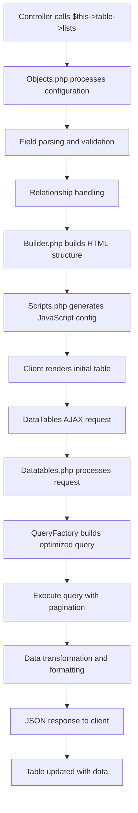
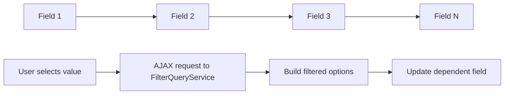

# Analisis Sistem Tabel CanvaStack

## Overview

Sistem tabel CanvaStack adalah sistem yang powerful dan fleksibel untuk menangani operasi datatables dengan server-side processing. Sistem ini dirancang untuk menangani berbagai sumber data (Eloquent Model, Query Builder, Raw SQL) secara dinamis tanpa hard-coding.

## Arsitektur Komponen Utama

### 1. Entry Point Layer

#### Objects.php
- **Fungsi**: Entry point utama dan orchestrator
- **Peran**: Mengatur konfigurasi, metadata, dan alur eksekusi
- **Fitur Utama**:
  - Fluent API dengan method chaining
  - Multiple traits untuk berbagai fungionalitas
  - Field dan label parsing
  - Relational data handling

### 2. Core Processing Layer

#### Builder.php
- **Fungsi**: Core builder untuk HTML dan konfigurasi
- **Peran**: Membangun struktur tabel dan mengatur rendering
- **Fitur Utama**:
  - HTML table generation
  - Column configuration
  - Header dan body construction
  - Filter modal integration

#### Datatables.php
- **Fungsi**: Server-side processing engine
- **Peran**: Menangani AJAX request dan data processing
- **Fitur Utama**:
  - Query building dan execution
  - Data transformation
  - Pagination dan sorting
  - Column formatting

### 3. Query Management Layer

#### QueryFactory.php
- **Fungsi**: Query building dan optimization
- **Peran**: Membangun query yang optimal dengan berbagai kondisi
- **Fitur Utama**:
  - Join handling
  - Where conditions
  - Filtering logic
  - Pagination

#### ModelQueryBridge.php
- **Fungsi**: Bridge antara berbagai sumber data
- **Peran**: Menangani abstraksi data source
- **Fitur Utama**:
  - Model resolution
  - SQL query handling
  - Dynamic table creation

### 4. Supporting Components

#### Search.php
- **Fungsi**: Advanced filtering system
- **Peran**: Menyediakan UI dan logic untuk filtering
- **Fitur Utama**:
  - Modal filter creation
  - Dynamic field dependencies
  - AJAX-based filtering

#### Scripts.php (Trait)
- **Fungsi**: JavaScript generation
- **Peran**: Generate DataTables JavaScript configuration
- **Fitur Utama**:
  - DataTables initialization
  - AJAX configuration
  - Event handling

## Alur Data GET Method



## Developer Experience (DX) Pattern

### 1. Fluent API Design
```php
$this->table->searchable(['field1', 'field2'])
           ->clickable()
           ->sortable()
           ->filterGroups('field', 'selectbox', true)
           ->lists($table, $fields);
```

### 2. Convention over Configuration
- Automatic field discovery
- Smart column type detection
- Default formatting rules
- Automatic relationship handling

### 3. Dynamic Field Handling
```php
// Inline labels dengan colon separator
['username:User Name', 'email:Email Address']

// Automatic relationship detection
$this->table->relations($model, 'group', 'group_info', $relations);
```

## Sistem Filtering dan Modal Interaksi

### 1. Filter Modal Generation
- **Lokasi**: Search.php
- **Proses**:
  1. Analisis field types dari database schema
  2. Generate form elements berdasarkan type
  3. Setup dependency chain antar fields
  4. AJAX integration untuk dynamic loading

### 2. Filter Dependency Chain


### 3. FilterQueryService Logic
- **Input**: Field dependencies, current selections
- **Process**: Dynamic SQL generation dengan JOIN dan WHERE clauses
- **Output**: Filtered options untuk dependent fields

## Handling Data Dinamis

### 1. Data Source Detection
```php
// Model detection
if (class_exists($source) && is_subclass_of($source, Model::class))

// Query Builder detection  
if ($source instanceof \Illuminate\Database\Query\Builder)

// Raw SQL detection
if (is_string($source) && str_contains($source, 'SELECT'))
```

### 2. Query Building Process
1. **Model Resolution**: Determine data source type
2. **Join Processing**: Handle foreign key relationships
3. **Condition Application**: Apply where clauses dan filters
4. **Pagination Setup**: Calculate offset dan limit
5. **Data Transformation**: Format output data

### 3. Relationship Handling
- **Foreign Keys**: Automatic JOIN creation
- **Relation Data**: Pre-loaded relationship data
- **Dynamic Fields**: Runtime field discovery

## Interaksi Sistem Rendering

### 1. HTML Generation
```php
// Table structure
$table = '<table id="'.$tableID.'" class="'.$tableClass.'">';
$table .= $this->header($data);
$table .= '</table>';
```

### 2. JavaScript Configuration
```javascript
$('#tableId').DataTable({
    serverSide: true,
    ajax: { url: 'endpoint?renderDataTables=true' },
    columns: [...],
    initComplete: function() { ... }
});
```

### 3. AJAX Endpoint Handling
- **URL Pattern**: `?renderDataTables=true&difta[name]=tableName`
- **Request Processing**: Datatables.php->process()
- **Response Format**: Standard DataTables JSON response

## Sistem Deteksi Pola Data

### 1. Model Type Detection
```php
$object_called = get_object_called_name($model);
if ('builder' === $object_called) {
    // Query Builder handling
} else {
    // Eloquent Model handling
}
```

### 2. Field Type Resolution
- **Database Schema**: Automatic type detection via `canvastack_get_table_column_type()`
- **Model Attributes**: Analyze model attributes dan casting
- **Runtime Detection**: Dynamic field type assignment

### 3. Relationship Pattern Recognition
```php
// Detect foreign key patterns
if (endsWith($field, '_id')) {
    // Potential foreign key
}

// Analyze relationship methods
if (method_exists($model, $relationshipName)) {
    // Valid relationship
}
```

## Core Strengths dari Sistem

1. **Fully Dynamic**: Tidak ada hard-coding untuk table atau field structure
2. **Multi-Source Support**: Eloquent, Builder, dan Raw SQL
3. **Advanced Filtering**: Complex filtering dengan dependency chain
4. **Performance Optimized**: Server-side processing dengan pagination
5. **Developer Friendly**: Fluent API dan convention-based configuration
6. **Extensible**: Plugin architecture dan trait-based functionality

## Areas yang Memerlukan Analisis Lebih Lanjut

1. **Performance Bottlenecks**: Query optimization opportunities
2. **Code Organization**: Potential separation of concerns
3. **Testing Coverage**: Unit dan integration testing gaps
4. **Error Handling**: Robust error handling mechanisms
5. **Caching Strategies**: Data dan query result caching
6. **Security Aspects**: SQL injection prevention dan data sanitization